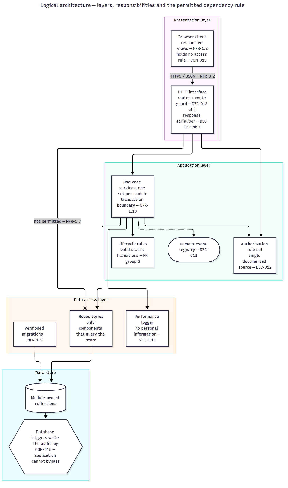
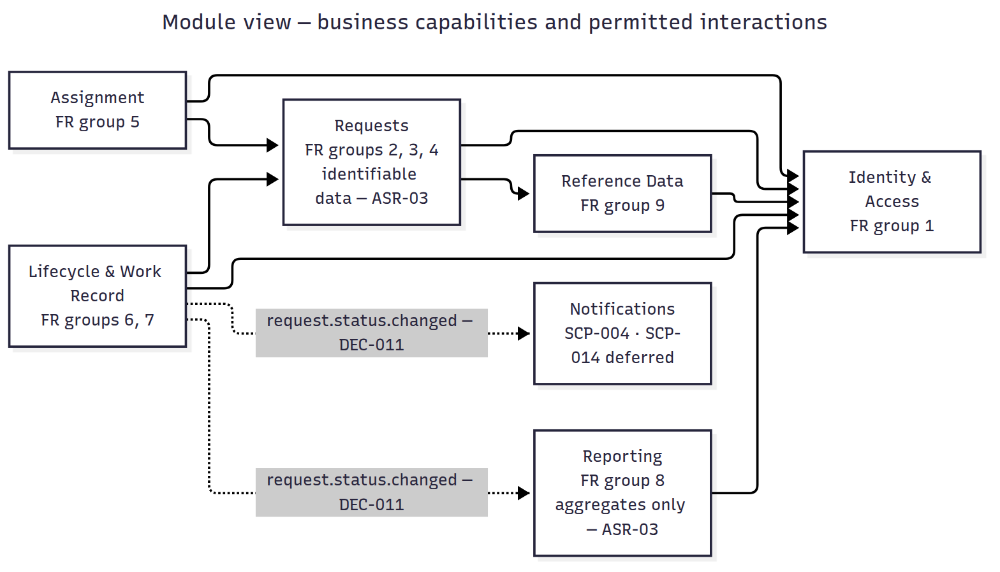
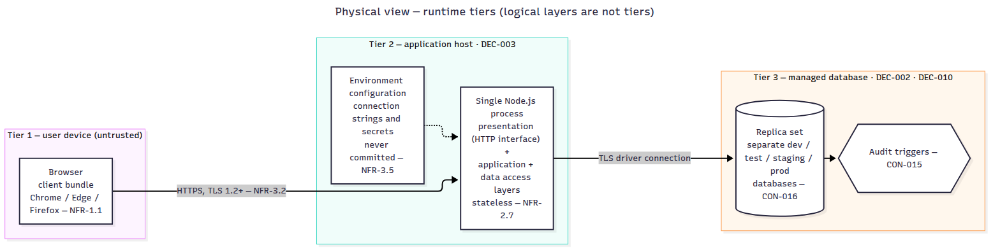
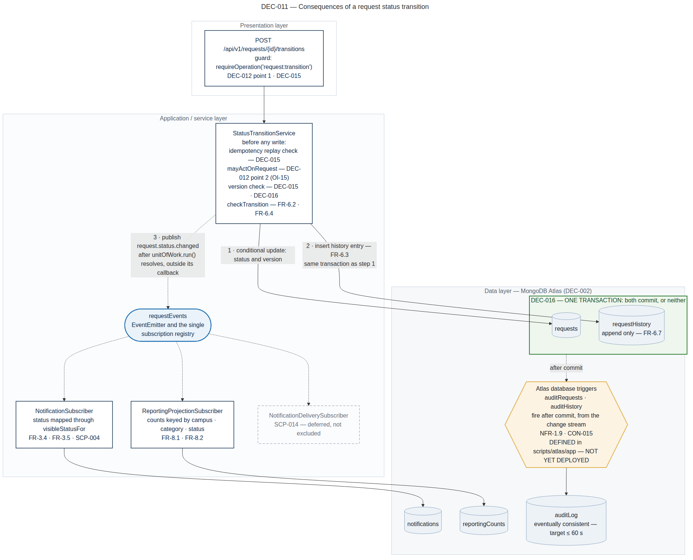
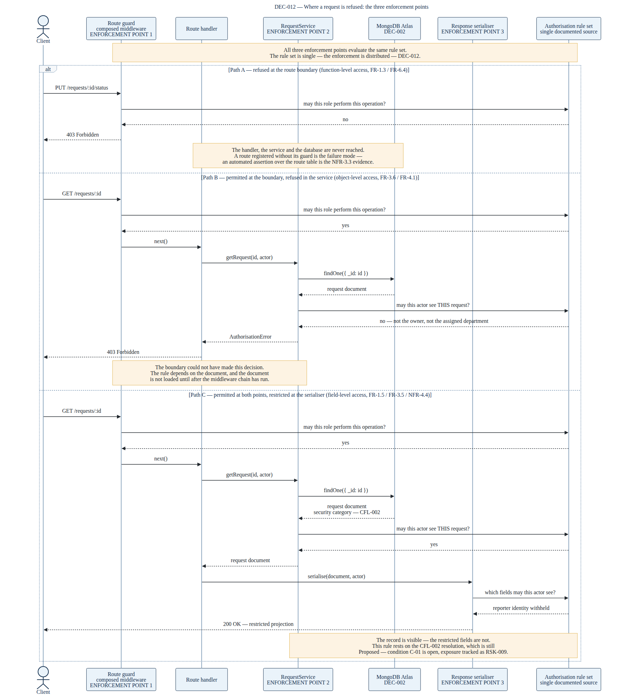

# Project Engineering Document

## CivicConnect — Campus Service Request Management Platform

**Version 2.0 — Milestone 2 Architecture, Technology & Initial Design Baseline**

| | |
|---|---|
| **Project** | CivicConnect — Campus Service Request Management Platform |
| **Module** | Software Engineering 381 (SEN381), NQF Level 8 |
| **Institution** | Belgium Campus ITversity |
| **Document** | Project Engineering Document (PED) |
| **Version** | 2.0 |
| **Status** | Baselined |
| **Date** | 30 September 2026 |
| **Supersedes** | PED v1.11 |
| **Governing document** | SEN381 CivicConnect Master Project Brief v1.1 |

---

## Document Control

| Role | Name | Responsibility in this document |
|---|---|---|
| Team Lead | Ethan Lindsay | M1 baseline review and controlled change; engineering decision log and architecture decision records; evolution of the requirements traceability matrix; initial design decisions; assembly of this document |
| Project Manager | Robert van der Merwe | Data and persistence baseline; technology stack selection and deployment compatibility; initial interface and integration decisions |
| Developer | Christiaan Burger | Architecturally significant requirements and architecture baseline; repository governance and CI controls; application and technical documentation; risk register; forward engineering considerations; AI usage register |

Responsibilities are recorded as they apply to this version. The v1.0 allocation —
Ethan Lindsay on problem, stakeholders, scope, constraints and the decision log; Robert
van der Merwe on requirements, acceptance criteria and the traceability matrix;
Christiaan Burger on risk, forward engineering considerations, repository governance and
the AI usage register — remains the attribution for the content baselined at that
version.

**Review model.** Every substantive change to a controlled artefact enters the
repository through a pull request requiring two approvals from members other than the
author, in accordance with Master Brief §9. No member self-approves.

**Approval of this baseline.** Recorded in Appendix B.

---

## Version History

| Version | Date | Author | Summary of change | Reviewed by |
|---|---|---|---|---|
| 0.1 | 06/09/2026 | E. Lindsay | Initial drafts: stakeholder register (STK-001–009), stakeholder conflicts (CFL-001–004), constraints (CON-001–008), scope baseline (SCP-001–020), decision log (DEC-001–007), problem and business need. PR #1 | R. van der Merwe, C. Burger |
| 0.2 | 08/09/2026 | E. Lindsay | Repository structure established; registers separated into requirements and decisions folders; DEC-008 recorded (two-stage protected branching). PR #14 | R. van der Merwe, C. Burger |
| 0.3 | 09/09/2026 | E. Lindsay | AI Usage Register established; client instructions of 09/09/2026 incorporated: STK-010 added; CON-009–CON-019 recorded; SCP-021 added; DEC-007 revised; DEC-009 recorded. PR #15 | R. van der Merwe, C. Burger |
| 0.4 | 09/09/2026 | E. Lindsay | PED document created; cascaded decision log updates applied across affected artefacts; scope baseline extended with a Type column distinguishing product from project scope. PR #16 | R. van der Merwe, C. Burger |
| 0.5 | 09/09/2026 | R. van der Merwe | Requirements baseline: 49 functional and 30 non-functional requirements (FR-1.1–FR-9.2, NFR-1.1–NFR-4.5), 80 acceptance criteria, RTM v0.2, traced example, open items register. PR #17 | E. Lindsay, C. Burger |
| 0.6 | 09/09/2026 | C. Burger | Risk register v0.3 (RSK-001–013) and forward engineering considerations register v0.2 (FEC-001–007 with recorded baseline influence). PR #18 | E. Lindsay, R. van der Merwe |
| 0.7 | 09/09/2026 | R. van der Merwe | Artefact updates derived from the additional client constraints recorded at v0.3. PR #19 | E. Lindsay, C. Burger |
| 0.8 | 09/09/2026 | R. van der Merwe | Project Charter v0.2: delivery window corrected to 5.57 weeks against confirmed dates; size estimate rescoped to 15.0 kLOC; §4.6 AI productivity assumption and velocity checkpoint added; PERT re-baselined | E. Lindsay, C. Burger |
| 0.9 | 09/09/2026 | C. Burger, R. van der Merwe | Risk Register v0.4: RSK-014 and RSK-015 added for the schedule and decision-deadline exposures arising from the corrected window. Project Charter v0.3: Member C's register adopted as authoritative with a reconciliation mapping in §7.1 | E. Lindsay |
| 1.0 | 09/09/2026 | E. Lindsay | Integration of all M1 artefacts into a single controlled document; references added; Team Working Agreement drafted; baseline conditions recorded; baseline sign-off completed | R. van der Merwe, C. Burger |
| 1.1 | | E. Lindsay | M1 baseline review: requirements, assumptions, constraints, acceptance criteria and forward engineering considerations reviewed against the evidence now available; changes recorded under controlled change and superseded content preserved | R. van der Merwe, C. Burger |
| 1.2 | | C. Burger | Architecturally significant requirements identified and linked to stakeholder, constraint and risk evidence; architecture baseline and diagrams recorded *(not used — this work was delivered as 1.6)* | E. Lindsay, R. van der Merwe |
| 1.3 | 29/09/2026 | R. van der Merwe | Data and persistence baseline (§6B): entities, aggregates, ownership and lifecycle; Mongoose schemas for `requests`, `requestHistory`, `notifications`, `reportingCounts`, `auditLog`, `users`/`roles`/`groups`; append-only constraint DB-01 stated at three layers; transaction boundary DEC-016 with CR-001 (AC-NFR-1.10); retention by purpose DEC-017 closing OI-06 with CR-002; PROC-001 manual anonymisation (interim control for NFR-4.2, SCP-020 deferred) with CR-003; CR-004 (NFR-2.6); RTM v0.5 data/persistence column completed (62 rows) and 10 populated cells corrected | E. Lindsay, C. Burger |
| 1.4 | 29/09/2026 | R. van der Merwe | Technology and deployment (§6C): DEC-003 recorded as a full ADR (Hostinger VPS + one Atlas free cluster per environment); DEC-010 closed (free cluster in production; 12-hourly `mongodump` to an institutional server for NFR-1.5); DEC-015 API semantics (versioned REST, ETag/If-Match, Idempotency-Key, RFC 9457 errors); runtime minimum set to Node 22 (engines ">=22.0.0"); RSK-018 to RSK-020 raised. Application slice build fixed: router and guard moved from `tests/` to `src/` (23/23 tests pass) | E. Lindsay, C. Burger |
| 1.5 | 29/09/2026 | E. Lindsay | Initial design decisions recorded as architecture decision records (DEC-011, DEC-012) with supporting component and sequence diagrams; requirements traceability matrix extended from nine columns to fourteen (v0.4); end-to-end trace for FR-6.7 recorded at §7.5 and completed into implementation and initial verification evidence | R. van der Merwe, C. Burger |
| 1.6 | 29/09/2026 | C. Burger | Architecturally significant requirements (ASR-01–06) and architecture baseline recorded as §6A: alternatives, layer responsibilities, business modules, physical tiers, DEC-014, Figures 3–5, RSK-016/017 and architecture sign-off | E. Lindsay, R. van der Merwe |
| 1.7 | 29/09/2026 | R. van der Merwe | Working draft: Member B content (rows 1.3 and 1.4) integrated into this document and merged with v1.6 (C. Burger) from `dev`; Member B identifiers renumbered to follow the §6A content already merged — DEC-014–016 → DEC-015–017, RSK-016–018 → RSK-018–020, §6A/§6B → §6B/§6C; register references aligned to the versions held in the repository (Decision Log v0.5, Risk Register V0.5, Open Items v0.3, Acceptance Criteria v0.3, Non-Functional Requirements v0.3, RTM v0.5); PED v1.6 archived in `docs/PED/PED/Outdated/` and RTM v0.4 in `docs/Outdated/`; `src/models/` aligned to the data baseline with `tests/models.test.js` (suite 39/39); AI Usage Register v0.5 records the Claude Code assistance for this work. Minor version used because .0 is reserved for the frozen milestone baseline | E. Lindsay, C. Burger |
| 1.8 | 30/09/2026 | C. Burger | Risk Register V0.6: RSK-016 and RSK-017 entered; RSK-002 and RSK-007 re-scored, RSK-008 closed (superseded by RSK-019 and RSK-020), RSK-012 recorded as mitigated, RSK-015 as materialised; M2 review column added and exposure-matrix formulas extended to all rows. FEC Register V0.3: M2 influence sheet (§9.5). RTM v0.6: ASR / quality-driver link and Architecture / module / component columns completed for all 79 rows (§6A.10). §7.5 cites ASR-02; §8.3, §8.4.1, §9.5 and Appendix A updated to the new register versions *(delivers the risk and FEC part of the row previously planned as 1.9)* | E. Lindsay, R. van der Merwe |
| 1.9 | 30/09/2026 | R. van der Merwe | Integration of two parallel v1.8 drafts: v1.8 (C. Burger, registers) merged with the Member B draft also numbered 1.8 on `task/M2-PersonB` (commit 375de35), whose content is carried here: Open Items v0.4 (v0.3 archived) with OI-14 (`reportingCounts` reconciliation, owner R. van der Merwe, target M3) and OI-15 (transition model confirmation, including whether a reopened-then-resolved request satisfies FR-6.5), cited in §6.5 and §12.2. Also: RTM v0.7 (implementation and verification evidence for the eleven requirements the slice implements after PR #63, three recorded as partial); DEC-002 recorded as an ADR with a weighted comparison matrix (§6C), cited from its row in Decision Log v0.6 (v0.5 archived); API contract `docs/api/openapi.yaml` v0.1 for the transition endpoint (DEC-015); AI Usage Register v0.6; superseded working notes removed. PED v1.7 and v1.8 archived in `docs/PED/PED/Outdated/` | E. Lindsay, C. Burger |
| 1.10 | 30/09/2026 | C. Burger | Continuous integration adopted (issue #52, PR #66): `.github/workflows/ci.yml` runs `npm ci`, `npm test`, a layer-boundary check (NFR-1.7, DEC-014, RSK-016) and a full-history secret scan (NFR-3.5) on every pull request to `dev` and `main`, both set as required status checks; pull request template adopted (#53); README extended with contribution, CI and repository-structure guidance (#54); AI Usage Register v0.7 (#55). §11.1 records the controls. Stale references corrected: §1.7.1 FEC version at M1 (v0.2), §6A.11 DEC-010 row, §7.1 RTM v0.7, §8.3.1, §10.6 application evidence, §11.3 AI Usage Register version, §12.1 decision-log count, open items and RTM version; Appendix A. `src/` realignment to module folders (#51) remains open *(the repository-structure part of the row planned since 1.6)* | E. Lindsay, R. van der Merwe |
| 1.11 | 30/09/2026 | E. Lindsay | Aligned to RTM v0.8 (NFR-3.3 added; FR-1.3 and FR-6.7 corrected to partial) in §1.7.1, §7.1, §7.2, §10.6, §12.1 and Appendix A; register citations moved to Open Items v0.5 (OI-16 raised, cited in §6.5 and Figure 2) and AI Usage Register v0.8 in §11.3, §12.1 and Appendix A; §10.7 opening sentence restored (truncated since v1.6); Figure 1 and Figure 2 captions updated for the corrected diagrams (PR #71); note added to §10.2 recording, without correcting, the decision-count error in the baselined v1.0; Appendix A paths corrected to `docs/Requirements/` | R. van der Merwe, C. Burger |
| 1.12 | | E. Lindsay, R. van der Merwe | Assumptions and dependencies updated against the architecture, data, technology, design, security, deployment and cost evidence produced at this milestone *(planned; the remainder of the row previously planned as 1.9; renumbered from 1.10, then 1.11)* | Reviewed by the two members other than each author |
| 2.0 | 30/09/2026 | E. Lindsay | Milestone 2 baseline. Architecture, Technology & Initial Design Baseline identified in §12: what is baselined and what is deliberately not. M1 conditions reviewed and their final M2 status recorded in Appendix B (C-01, C-02 and C-05 open; C-03 partially closed; C-04 closed), with the M2 baseline sign-off block. Citations aligned to the versions held in the repository: AI Usage Register v0.9, Scope Baseline v0.3, Non-Functional Requirements v0.3, Acceptance Criteria v0.3, Data and Persistence Baseline v0.2, Team Working Agreement v0.2. The Data and Persistence Baseline (R. van der Merwe) and the Team Working Agreement (team) moved from draft to approved status by a header-only change, so that no baselined artefact describes itself as a draft; their content is unchanged. PED v1.11 archived | R. van der Merwe, C. Burger |

Baselined content is not silently overwritten. Changes after this baseline follow the
change control process in Master Brief §14.

---

## Contents

1. Introduction
2. Problem and Business Need
3. Stakeholder Analysis
4. Scope Baseline
5. Constraints
6. Requirements and Acceptance Criteria
   - 6A. Architecturally Significant Requirements and Architecture Baseline
   - 6B. Data and Persistence Baseline
   - 6C. Technology Stack, Versions and Deployment Compatibility
7. Traceability
8. Risk Management
9. Forward Engineering Considerations
10. Engineering Decisions
11. Governance, Accountability and AI Controls
12. Baseline Statement
13. References
- Appendix A — Controlled Artefact Index
- Appendix B — Baseline Sign-Off

---

# 1. Introduction

## 1.1 Purpose of this document

This document is the single evolving engineering record for the CivicConnect project.
It is not a milestone report. Version 1.0 established the Milestone 1 baseline; this
version extends the same document to v2.0 at architecture and design, and the same
document will be extended again to v3.0 at controlled construction and release
readiness, and to v4.0 at final product evaluation.

Its purpose at v1.0 was to state what the team had committed to engineer, for whom,
within what constraints, what had deliberately not been decided, and how change to that
commitment would be controlled.

Its purpose at v2.0 is to record how that commitment has been translated into
architecture, data, technology and initial design decisions; what evidence supports each
of those decisions and what alternatives were rejected; what application evidence now
exists against the resulting direction; and what remains deliberately undecided at this
checkpoint.

## 1.2 Scope of this document

At v1.0 this document covered the engineering foundation only. Architecture, technology
selection, persistence design, interface design and implementation were outside
Milestone 1 and were recorded only where a decision had been deliberately deferred and
the evidence required to close it stated.

At v2.0 that boundary moves. This version additionally covers the architecturally
significant requirements and the architecture baseline, the data and persistence
baseline, the technology-stack selection and deployment-compatibility position, the
initial design decisions informed by the team's Assignment 2 research, and the
application evidence produced against them.

What remains outside this version is stated so that its absence is not read as an
omission: a completed application, a mature continuous delivery pipeline, complete
automated test coverage, production deployment, final performance or security testing,
and detailed design for every component the system will eventually contain. Where any of
these is anticipated rather than delivered, it is carried as a deferred decision or a
forward engineering consideration rather than asserted.

## 1.3 Structure and controlled artefacts

Several artefacts referenced here are live registers maintained as separate
controlled files in the project repository rather than reproduced in full below. This
follows the M1 requirement that outputs be integrated into the PED and/or linked as
controlled project artefacts. Each section states what its artefact contains, why it
exists and what it constrains downstream; Appendix A indexes every file and its
repository location.

## 1.4 Identifier scheme

Identifiers are stable and are not reused. A retired item keeps its identifier and is
marked superseded rather than being renumbered.

| Prefix | Artefact |
|---|---|
| STK-nnn | Stakeholder |
| CFL-nnn | Stakeholder conflict |
| SCP-nnn | Scope baseline item |
| CON-nnn | Constraint |
| FR-n.n | Functional requirement |
| NFR-n.n | Non-functional requirement |
| AC-FR-n.n / AC-NFR-n.n | Acceptance criterion |
| DEC-nnn | Engineering decision |
| ASR-nn | Architecturally significant requirement |
| RSK-nnn | Risk (engineering register) |
| RK-nn | Risk (Project Charter quantified register) |
| FEC-nnn | Forward engineering consideration |
| OI-nn | Open item |

## 1.5 Acronyms

Acronyms follow the table in Master Brief §Acronyms and Abbreviations. Terms are
written in full on first use where clarity requires it.

## 1.6 Relationship to version 1.0

Version 1.0 established the engineering foundation: the problem and business need, the
stakeholder analysis, the scope baseline, the constraints, the requirements baseline and
the decisions the team was able to take on the evidence then available. This version does
not restate that work. It extends the same document with the architecture, data,
technology and initial design decisions that became supportable once the Week 2 teaching,
the team's Assignment 2 research and the first implementation evidence were available.

Three categories of change are distinguished throughout, so that what was established at
M1 can be separated from what has been decided since:

| Category | Treatment in this document |
|---|---|
| **Carried forward unchanged** | Baselined content that the M2 evidence did not disturb. It remains exactly as recorded at v1.0 and is not restated or re-justified. |
| **Changed under control** | Baselined content that materially changed. The original is preserved together with the reason for change, in accordance with Master Brief §14. A change is visible in the version history above and in the affected artefact's own version record. |
| **New at v2.0** | Decisions, artefacts and application evidence that did not exist at M1. These carry their version of record in the section that introduces them and in Appendix A. |

Assignment 2 provided research, alternatives and recommendations relevant to several of
the decisions recorded here. Where that research informs a decision, the decision record
references the relevant finding, source or Assignment 2 section; the research discussion
itself is not reproduced in this document, and an Assignment 2 recommendation is not
treated as a project decision. Where the team's final judgement differs from the
recommendation, the decision record states the project-specific evidence that produced
the difference.

## 1.7 Milestone 1 baseline review

The M1 baseline was reviewed before any Milestone 2 decision was recorded in this
document. The order matters. An architecture, data or technology decision taken against
a requirement that has since changed, or against a constraint that has since been
clarified, is a decision taken on stale evidence, and its consequences are discovered
late. This review establishes which M1 commitments still hold, which have changed, and
which remain open, so that the decisions recorded in the sections that follow rest on a
current foundation.

**Method.** Each baselined artefact was examined against four sources of change: client
instruction issued since 9 September 2026; evidence produced by the team's Assignment 2
research; decisions closed since the baseline; and experience from the first
implementation work. Every reviewed item was resolved into one of the three categories
defined in §1.6. No baselined item was edited in place. Where content changed it did so
through the process in Master Brief §14, and the original wording and the reason for
change are preserved in the affected artefact.

### 1.7.1 Artefacts reviewed

| Artefact | Version at M1 | Outcome of review |
|---|---|---|
| Stakeholder Register | v0.2 | Carried forward unchanged. No stakeholder was added, withdrawn or re-positioned since baseline. |
| Stakeholder Conflicts | v0.1 | Carried forward unchanged. All four resolutions remain *Proposed*; see §1.7.2. |
| Scope Baseline | v0.2 | Changed under control. SCP-014 and SCP-015 are released from their dependency on DEC-003, and SCP-020 from its dependency on DEC-005, both decisions having closed at this milestone. |
| Constraints | v0.2 | Carried forward unchanged. CON-015 interacts directly with the technology selected under DEC-002 and was examined against it; the constraint is satisfiable as written and required no amendment. See §1.7.2. |
| Functional Requirements | v0.2 | Carried forward. FR-4.2, FR-8.4 and FR-9.1 remain *Proposed* against open items OI-01 to OI-03. |
| Non-Functional Requirements | v0.2 | Changed under control. NFR-4.2 is released from OI-05 by the closure of DEC-005 and now states the agreed retention period. The measurement bases of NFR-1.4, NFR-1.9 and NFR-4.2 are amended under CR-002 (DEC-017), and those of NFR-2.6 and FR-6.7 under CR-004 and CR-003. |
| Acceptance Criteria | v0.2 | Changed under control where the underlying requirement changed. AC-NFR-4.2 v0.3 is supplied by CR-002 and AC-NFR-1.10 v0.3 by CR-001. The register file is at v0.3 with the evaluable AC-NFR-4.2; AC-NFR-1.10 v0.3 is applied when CR-001 is approved. Otherwise carried forward. |
| Requirements Traceability Matrix | v0.2 | Extended at this version with the architecture, data, design, technology, implementation and verification evidence columns (v0.4), the data/persistence column completed at v0.5, the ASR and architecture columns at v0.6, and implementation and verification evidence begun at v0.7 and extended at v0.8. See §7. |
| Risk Register | v0.4 | Updated at v0.5 and v0.6 with the architecture, data, technology, dependency, design, security, deployment, cost and implementation exposures arising at this milestone. See §8. |
| Forward Engineering Considerations Register | v0.2 | Reviewed; the influence each consideration exerted on the decisions recorded at this version is stated in §9. |
| Engineering Decision Log | v0.2 | Extended with the decisions recorded at this milestone and with the disposition of the three deferments carried from M1. See §10. |
| AI Usage Register | v0.1 | Extended for the Milestone 2 period. The completeness limitation disclosed in §11.4 is addressed or carried forward as recorded there. |

### 1.7.2 Open questions the review was required to settle

The M1 baseline was accepted conditionally, and eight specific questions were left open
against it. Each is resolved or explicitly carried forward here, with the position at
this review recorded against the position at baseline.

| Open question | Position at M1 | Position at this review |
|---|---|---|
| DEC-002 — technology stack | Deferred. Evidence required stated as verified availability in the institutional environment under CON-008. Working deadline of 22 September imposed by CON-013 | **Closed.** A MERN stack was selected: MongoDB, Express, React and Node.js. The selection was made against the five build-repeatability properties identified in the team's Assignment 2 research, together with the CON-008 availability position and the CON-004 team-capability constraint. The decision closed after the 22 September working deadline imposed by CON-013; that overrun and its consequence are recorded against C-04 and C-05 in Appendix B. **The interaction with CON-015 was examined and the constraint holds.** CON-015 requires database changes to be auditable through triggers and logging, and a self-managed MongoDB deployment provides no relational-style trigger. The decision therefore commits to MongoDB Atlas as the managed database service rather than to a self-managed instance: Atlas provides managed database triggers that execute on document insert, update and delete, and its clusters are deployed as replica sets, so change streams and multi-document transactions are both available. The transactional position carried in the team's Assignment 2 persistence research therefore transfers rather than being displaced, and CON-015 required no amendment. **One consequence remains open.** Free Atlas clusters do not support managed backups, and the documented alternative is a scheduled export and restore. NFR-1.5 requires recovery to a state no more than 24 hours old following total loss of the primary data store, so on a free cluster that obligation rests on an operated schedule rather than on a platform capability. The cluster tier and the mechanism by which NFR-1.5 is met are recorded as a new deferment, DEC-010. |
| DEC-003 — hosting and deployment platform | Deferred. SCP-014 and SCP-015 blocked behind it. Same working deadline. Tracked as RSK-008 and RSK-015 | **Closed.** Hostinger was selected as the hosting and deployment platform. SCP-014 and SCP-015 are released from their dependency on this decision. Two items must be recorded against the plan actually selected rather than against the platform in general: the evidence stated at deferment — documented limits covering audit log retention, backup and likely operational cost beyond the educational context — and the position on where the MongoDB instance runs, since the deployment topology required by the DEC-002 interaction above is a dependency of this decision |
| DEC-005 — personal-information retention period | Deferred pending guidance from STK-009. NFR-4.2 and SCP-020 blocked behind it. Highest exposure in the register as RSK-002 | **Closed.** A retention period of one month for identifiable personal information was agreed. NFR-4.2 and SCP-020 are released from their dependency on it, and RSK-002 is re-scored accordingly. The decision entry should record the basis on which one month was agreed, since CON-007 requires the retention position to be defensible under POPIA rather than merely stated, and SCP-020 remains deferred as a capability even though the period it would enforce is now fixed |
| CFL-001 to CFL-004 — stakeholder conflict resolutions | All four recorded as *Proposed*; none confirmed with the stakeholder concerned. CFL-002 carries the greatest exposure and was to close before the M2 data model was fixed | **Carried forward.** None of the four resolutions has been confirmed with the stakeholder concerned. CFL-002 in particular remains *Proposed*, so FR-1.5, FR-3.5, NFR-3.3 and NFR-4.4 — a substantial part of the security requirement set — continue to rest on a resolution STK-006 has not agreed. The exposure is unchanged from baseline and remains tracked as RSK-005 and RSK-009. The architecture and design decisions recorded in this version proceed on the team's proposed resolution and would require revision if it is not agreed. Condition C-01 remains open |
| FR-4.2, FR-8.4, FR-9.1 | Proposed against open items OI-01 to OI-03 | **Carried forward.** All three remain *Proposed* against OI-01 to OI-03. No evidence closing them arrived during this milestone, and their RTM status is unchanged |
| NFR-4.2 | Blocked against OI-05. States a retention period that cannot be written until DEC-005 closes | **Closed.** Released from OI-05 by the closure of DEC-005. The requirement now states the agreed one-month retention period (measured as 30 days from closure, CR-002) and its acceptance criterion is evaluable by a third party. It is enforced by procedure PROC-001 while SCP-020 remains deferred |
| OI-06 — NFR-1.4 (90 days) against DEC-005 (one month) | Escalated at v0.3 | **Closed by DEC-017.** Retention is set per purpose. Request data: 30 days from closure (purpose A). `auditLog`: ≥ 90 days as a separate accountability purpose (POPIA s.14(1), related lawful purpose), with content minimised to identifiers, field names and status values so that no purpose-A value outlives DEC-005. Neither figure changes; the bases are amended under CR-002 |
| DEC-010 — Atlas cluster tier and NFR-1.5 mechanism | New deferment recorded at this milestone | **Closed.** The free cluster is retained; NFR-1.5 is met by an operated, encrypted 12-hourly `mongodump` to an institutional server with a weekly restore test (§10.8). Evidence item E1 (institutional server confirmation) is open |
| Service-level target behind "overdue" | No decision log entry existed for it. Recorded as RSK-003 and as condition C-02; SCP-011 cannot be specified precisely without it | **Carried forward.** No service-level target has been agreed with STK-005 and no decision log entry exists for it. SCP-011 therefore remains specified imprecisely and no acceptance criterion for it can be evaluated by a third party. RSK-003 is unchanged and condition C-02 remains open |
| Capacity and schedule position | Project Charter v0.3 §4.6 records that the baselined scope exceeds deliverable capacity within the window. A velocity checkpoint was set at the CON-013 gate of 29 September, with a scope-reduction order to be agreed in advance | **Carried forward, not measured.** No velocity measurement was taken at the 29 September gate and no scope-reduction order was agreed in advance of it. The AI-assisted productivity assumption on which the delivery schedule rests is therefore still unsubstantiated. RSK-014 is unchanged and condition C-05 remains open |

Three of these — DEC-002, DEC-003 and the capacity position — had dated deadlines that
fell before this review. Where a deadline was not met, the review records that fact and
its consequence rather than restating the original intention.

### 1.7.3 Assumptions re-examined

Three figures carried in the M1 baseline are team assumptions rather than
stakeholder-validated values. Each was re-examined at this review because the
architecture, data and technology decisions recorded later in this document depend on
them.

| Assumption | Where recorded | Position at this review |
|---|---|---|
| Recovery to a state no more than 24 hours old | NFR-1.5, measurement basis; open item recorded | Carried forward as a team assumption. The figure has not been validated with the stakeholder who would bear the loss of a day's requests. The closure of DEC-003 makes the backup and restore capability of the selected platform determinable, so the evidence required to test the assumption is now obtainable |
| Approximately 10 000 requests in the first year | NFR-2.2, measurement basis; open item recorded | Carried forward as a team assumption. No usage evidence exists against which to test the figure, and none will exist before the platform is in operational use |
| AI-assisted productivity multiplier underpinning the schedule | Project Charter v0.3 §4.6, assumption A14 | Not measured. The velocity checkpoint set at the CON-013 gate did not take place. The assumption remains unsubstantiated, which is material because the delivery schedule depends on it and because no implementation evidence existed at the gate against which velocity could have been measured |

The approximately 100 concurrent users in NFR-2.1 and NFR-2.4 is client-supplied under
CON-010 and was not re-opened, since it is a stated constraint rather than a team
estimate.

### 1.7.4 Effect of the review on this version

The review closed three of the eight open questions carried from Milestone 1 and
carried five forward. The three deferments recorded at baseline — DEC-002, DEC-003 and
DEC-005 — are now decided, which releases SCP-014, SCP-015, SCP-020 and NFR-4.2 from
their dependencies and permits the architecture, data and technology decisions recorded
in the sections that follow.

Two findings from the review bear directly on those decisions and are recorded rather
than absorbed. The technology selected under DEC-002 satisfies the CON-015 audit
obligation only through a managed database service rather than a self-managed instance,
and the free tier of that service does not support managed backups, so the recovery point
asserted in NFR-1.5 cannot yet be evidenced; this is carried as a new deferment, DEC-010.
And no implementation evidence existed at the CON-013 gate and no velocity measurement
was taken, so the schedule assumption carried since Milestone 1 remains unsubstantiated.

Three conditions from the M1 baseline are carried forward rather than closed: C-01, C-02
and C-05. Their status is recorded in Appendix B. The team's position is that a condition
carried forward with its exposure stated is a more useful engineering record than a
closure the available evidence does not support.

---

# 2. Problem and Business Need

## 2.1 Problem statement

The campus currently manages service requests through a fragmented combination of
email, telephone calls, WhatsApp messages, spreadsheets and paper records. Requests
span facility faults, damaged equipment, security concerns, IT support, maintenance
issues and lost property.

The defining characteristic of the current process is not that requests go unhandled,
but that **no single controlled record of a request's lifecycle exists**. Each channel
holds a partial view. Nothing reconciles them.

Four consequences follow from that root cause, each affecting a different stakeholder
group:

**Requests are lost between channels.** A request submitted by email and repeated by
WhatsApp becomes two requests, or none. There is no mechanism to detect duplication
because there is no shared record to compare against.

**Requesters cannot see what is happening.** A requester (STK-001) has no way to
determine whether a request was received, assigned, delayed or resolved without
contacting someone directly — which generates further informal traffic and compounds
the original problem.

**Ownership and accountability are unclear.** Staff (STK-002, STK-003) cannot reliably
establish who is responsible for a request. Changes to status and actions taken are
not attributable to an acting person, so the coordinator (STK-004) cannot resolve
competing claims of ownership or identify unassigned work.

**Management has no reliable operational picture.** The operations manager (STK-005)
cannot answer basic questions — what is open, what is overdue, what has been resolved
— without manual collation. Reporting is inconsistent and cannot be audited.

A fifth concern cuts across all of these: sensitive request information, including
security concerns and personal information of students and staff, is currently handled
inconsistently across informal channels with no access control and no audit trail.

## 2.2 Business need

The campus needs a controlled digital platform that provides a reliable, traceable and
usable way to submit, manage, monitor and report on service requests.

The need is not primarily for new capability. Requests are already submitted, assigned
and resolved today. The need is for those activities to occur against **a single
authoritative record**, with attribution of who did what and when, and with access
appropriate to the sensitivity of the information involved.

The solution must achieve this without creating an unsustainable technical,
operational or financial burden. This is a constraint on the solution, not an
aspiration: it is recorded as CON-003 and CON-004 and it directly shapes what has been
committed to scope.

## 2.3 Intended stakeholder value

| Stakeholder | Value delivered | Traceable to |
|---|---|---|
| Requester (STK-001) | Confirmation that a request was received, and visibility of its status without contacting staff | SCP-003, SCP-004 |
| Technicians (STK-002, STK-003) | A clear view of work they are responsible for, with status updatable at the point of work | SCP-005, SCP-008 |
| Service desk coordinator (STK-004) | A single queue in which duplication and unassigned work are visible | SCP-006, SCP-007 |
| Operations manager (STK-005) | Reliable information on open, overdue, resolved and closed work by category | SCP-011 |
| Security officer (STK-006) | Sensitive reports handled with restricted visibility rather than in open channels | SCP-012, CFL-002 |
| System administrator (STK-007) | A defined role model with controlled assignment and revocation of access | SCP-012 |
| Executive sponsor (STK-008) | Service accountability without unsustainable operational cost | CON-003, DEC-003 |
| Information officer (STK-009) | Auditable, access-controlled handling of personal information | CON-007, SCP-012 |

STK-010 is not listed above. The client proxy's interest is in evidence of controlled
engineering rather than in operational value delivered by the running system, and is
addressed through the governance controls in §11 rather than through delivered
capability.

## 2.4 How success will be judged

Project success is not "the system works". It is whether the problems in 2.1 are
demonstrably reduced. Three measures follow directly from the problem statement, each
now expressed as measurable requirements:

1. **Single record** — a request exists once, in one place, with a complete lifecycle
   history attributable to acting users. Verified through FR-6.7, NFR-1.4 and NFR-3.6.
2. **Visibility** — a requester can determine the state of their request without
   contacting a member of staff. Verified through FR-3.x and NFR-2.1.
3. **Reportable position** — management can obtain the open, overdue and resolved
   position without manual collation. Verified through FR-8.x and NFR-2.3.

Measure 3 carries a known gap: "overdue" has no agreed service-level definition. This
is recorded as RSK-003 and remains open at baseline.

## 2.5 Relationship to scope

Two boundaries follow directly from this analysis and are recorded in the scope
baseline.

The platform **replaces** the fragmented channels rather than federating them
(SCP-017). Ingesting requests from email and WhatsApp would preserve the duplication
that §2.1 identifies as the root cause, so integration with the existing channels is
out of scope by design rather than by omission.

Access control is **in scope despite not being a stated business capability**
(SCP-012). The sensitivity concern in §2.1 and the conflict resolution in CFL-002 make
role-based access a precondition of the platform being usable for security concerns at
all.

---

# 3. Stakeholder Analysis

## 3.1 Purpose

The stakeholder register exists to make the origin of every requirement traceable. A
requirement without an identified stakeholder cannot be prioritised against competing
needs and cannot be validated at M4 against the expectation that produced it. The
register is the left-hand end of the traceability chain in §7.

**Controlled artefact:** Stakeholder Register v0.2 (see Appendix A).

## 3.2 Stakeholders identified

Ten stakeholders are recorded, each with their relationship to the system, primary
need, influence, interest and engagement approach.

| ID | Stakeholder | Primary need | Influence | Interest |
|---|---|---|---|---|
| STK-001 | Student / staff requester | Submit quickly and know the request was received and what is happening | Low | High |
| STK-002 | Facilities / maintenance technician | See assigned work clearly and update status from where the work is done | Medium | High |
| STK-003 | IT support technician | Same queue behaviour, different categories and turnaround expectations | Medium | High |
| STK-004 | Service desk coordinator | Avoid duplicate and unassigned requests; visibility of the whole queue | Medium | High |
| STK-005 | Operations manager | Reliable view of open, overdue, resolved and closed work by category | High | High |
| STK-006 | Campus security officer | Restricted handling and visibility of sensitive security reports | Medium | Medium |
| STK-007 | System administrator | A manageable role model with reliable onboarding and revocation | Medium | Medium |
| STK-008 | Campus executive sponsor | Accountability and service performance without unsustainable cost | High | Medium |
| STK-009 | Information officer / POPIA compliance | Lawful, auditable handling of student and staff personal information | High | Low |
| STK-010 | Lecturer / client proxy | Evidence of controlled engineering, not only working software | High | High |

## 3.3 Influence and interest positioning

Positioning determines whose need takes precedence when two conflict, and how each
stakeholder is engaged.

| | Lower interest | Higher interest |
|---|---|---|
| **Higher influence** | **Keep satisfied** — STK-006, STK-007, STK-008, STK-009 | **Manage closely** — STK-002, STK-003, STK-004, STK-005, STK-010 |
| **Lower influence** | **Monitor** — none identified | **Keep informed** — STK-001 |

The Monitor quadrant is empty. Every stakeholder identified holds either power over
the project or a direct stake in its outcome, so none can be safely disregarded.

STK-009 illustrates why the two dimensions are held apart. The information officer has
almost no day-to-day involvement but can prevent the platform operating lawfully. When
their need conflicts with an operational one, the compliance position prevails — and
that precedence has a recorded basis rather than resting on preference.

## 3.4 Competing stakeholder needs

Four conflicts are recorded where stakeholder needs cannot both be fully satisfied.
Each states why the tension is real and what changed in scope or requirements as a
result.

**Controlled artefact:** Stakeholder Conflicts v0.1.

| ID | Tension | Resolution | Status |
|---|---|---|---|
| CFL-001 | Requester submission speed (STK-001) vs reporting richness (STK-005) | Mandatory fields limited to category, location and description; further detail prompted after submission | Proposed |
| CFL-002 | Requester transparency (STK-001) vs security confidentiality (STK-006) | Security-category requests expose a reduced status set to the requester; detail restricted to an authorised security role | Proposed |
| CFL-003 | Technician self-selection (STK-002, STK-003) vs assignment accountability (STK-004) | Coordinator assigns by default; technicians may accept unassigned requests within their own category; every transition records the acting user | Proposed |
| CFL-004 | Reporting history (STK-005) vs data minimisation (STK-009) | Retention period defined for identifiable data with aggregated statistics retained beyond it; period deferred | Proposed — retention deferred |

**Status disclosure.** All four resolutions are recorded as *Proposed*. They represent
the team's engineering position and have driven the requirements baseline, but none has
been confirmed with the stakeholder concerned. CFL-002 carries the greatest exposure:
it produced SCP-012, DEC-004 and a substantial part of the security requirement set, and
is tracked as RSK-005 and RSK-009. Confirming CFL-002 with STK-006 before the M2 data
model is fixed is the highest-value stakeholder action outstanding.

## 3.5 Downstream effect

CFL-002 is the clearest illustration of a stakeholder conflict propagating into
engineering commitment. Restricting security-request visibility by role required
authorisation to become an architectural concern rather than an application detail
(DEC-004), placed authentication and role-based access control into scope even though
it is not a stated business capability (SCP-012), and generated FR-1.5, FR-3.5,
NFR-3.3 and NFR-4.4. A stakeholder disagreement, followed forward, becomes an
architecture constraint.

---

# 4. Scope Baseline

## 4.1 Purpose

The scope baseline is the reference against which every later change is assessed. Once
baselined, an addition is not absorbed silently; it is a change request with an impact
analysis under Master Brief §14. Recording what is deliberately excluded matters as
much as recording what is included — an unstated exclusion is indistinguishable from an
oversight.

**Controlled artefact:** Scope Baseline v0.3. The tables below are the M1 baseline text; v0.3 revises
the bases of SCP-014, SCP-015 and SCP-020 under control (§1.7.1).

## 4.2 Baseline summary

Twenty-one items are classified. Each item is typed as **Product** (a capability of the
CivicConnect system) or **Project** (a deliverable of the project itself).

| Classification | Count |
|---|---|
| In scope | 13 |
| Deferred | 4 |
| Out of scope | 4 |
| **Total** | **21** |

## 4.3 In scope

SCP-001 to SCP-011 deliver the minimum requester, staff and management capabilities
required by Master Brief §3: submission with a controlled category, status and history
visibility, feedback on state change, authorised staff access, search and filtering,
assignment, controlled status transitions with the acting user recorded, action and
resolution recording, authorised closure, and the management view of open, overdue,
resolved and closed work.

SCP-012 (authentication and role-based access control) is in scope although it is not
listed as a business capability, for the reasons in §3.5.

SCP-021 (project charter, work breakdown structure and timeline) is the single Project
item, directed by the client on 09/09/2026. It is also a dependency: the PERT
estimation required by CON-009 needs the activity decomposition the WBS provides.

## 4.4 Deferred

| ID | Item | Basis |
|---|---|---|
| SCP-014 | Email or push notification of status changes | Depends on a delivery service whose cost and free-tier limits are unknown until the platform decision (DEC-003). In-application feedback under SCP-004 meets the minimum capability in the interim |
| SCP-015 | Photograph attachments | Introduces storage cost, malware scanning and additional personal-information handling under CON-007 |
| SCP-019 | Multi-campus or multi-tenant operation | Single-campus operation satisfies current stakeholders; deferred rather than excluded so the M2 data model does not foreclose it |
| SCP-020 | Automated enforcement of the retention period | The retention period itself is undecided (DEC-005); automating enforcement would encode an unverified assumption |

## 4.5 Out of scope

| ID | Item | Basis |
|---|---|---|
| SCP-013 | Native mobile application | Responsive web meets the access need within CON-002 and CON-004; confirmed as a client directive under CON-011 |
| SCP-016 | Integration with existing campus systems | No evidence that institutional interfaces exist or would be accessible; committing to an unverifiable integration creates unmanageable dependency risk (CON-008) |
| SCP-017 | Ingestion from existing email, telephone or WhatsApp channels | The business need is to replace fragmented channels with a single controlled record; ingestion would preserve the duplication the platform exists to remove |
| SCP-018 | Technician scheduling, rostering or workload balancing | Not a stated capability and not raised by any identified stakeholder; would substantially expand the domain model under a fixed schedule |

## 4.6 Exclusion defended: SCP-017

SCP-017 is the exclusion the team defends most directly, because it is the one that
looks most like a missing feature.

The scenario names duplication across channels as a primary failure. Ingesting from
those channels would federate them rather than replace them, and the duplication that
§2.1 identifies as the root cause would persist inside the platform. The engineering
position is that the single authoritative record is the mechanism by which duplication
is removed, and that anything preserving a second write path defeats it.

The exclusion carries a real cost, recorded as RSK-001 at the highest exposure band in
the register: requesters may continue using the informal channels regardless, leaving
the coordinator to capture those requests manually. The mitigation is that
coordinator-side capture keeps every request inside the single record even when the
requester does not use the platform directly. If pilot evidence shows informal channel
use persisting at volume, the correct response is a change request against this
baseline, not an unrecorded reversal.

SCP-016 rests on a different basis worth distinguishing: it is excluded for lack of
evidence rather than on principle. If institutional interfaces prove available, that
is new evidence and the exclusion should be revisited through change control.

---

# 5. Constraints

## 5.1 Purpose

Constraints are fixed conditions the project must engineer within. Recording a
constraint is not the engineering act; stating what it *implies* is. Each entry
therefore carries an engineering implication and, where relevant, the constraints it
interacts with and the trade-off that interaction creates.

**Controlled artefact:** Constraints v0.2.

## 5.2 Constraints recorded

Nineteen constraints are recorded across five categories.

| Category | Count | Constraints |
|---|---|---|
| Scope | 2 | CON-001, CON-011 |
| Schedule | 3 | CON-002, CON-009, CON-013 |
| Cost & resources | 3 | CON-003, CON-004, CON-008 |
| Quality | 8 | CON-005, CON-010, CON-012, CON-014, CON-015, CON-016, CON-017, CON-018 |
| Security | 3 | CON-006, CON-007, CON-019 |

CON-001 to CON-008 derive from the Master Brief. CON-009 to CON-019 derive from client
instruction issued verbally on 09/09/2026 and captured under the process recorded as
DEC-009.

## 5.3 Selected implications

| ID | Constraint | Engineering implication |
|---|---|---|
| CON-001 | Minimum capability floor, baselined and change-controlled | Sets a floor that cannot be traded away under schedule pressure; every addition must be justified against its effect on the other constraints |
| CON-003 | Free or low-cost services preferred; free-tier limits must be identified | Free tiers commonly restrict backups, private networking and audit log retention, so the hosting decision cannot be made on price alone |
| CON-004 | Three part-time students; technology limited to what the team can support | Team capability is an engineering input, not a preference; an unfamiliar stack spends schedule on learning rather than verification |
| CON-007 | POPIA obligations over student and staff personal information | Constrains what may be captured, who may view it, how long it is retained and whether access is auditable (Republic of South Africa, 2013) |
| CON-008 | Institutional platform availability is not guaranteed | Compatibility must be verified before technology is committed; a technically sound choice may prove undeliverable |
| CON-009 | Effort and development time must be estimated (COCOMO / PERT) | Requires a size estimate before M2 scope can be responsibly fixed, and requires scope reduction rather than optimistic adjustment where the calculated time exceeds the window |
| CON-010 | Approximately 100 users, with reasoning to 1000 | Converts a scalability aspiration into a testable figure; rules out in-memory session state and unindexed scans |
| CON-012 | Layered architecture required | Removes architectural style from the M2 decision space; the M2 record justifies layer boundaries rather than selecting a style |
| CON-013 | Demonstrable frontend, backend and API progress from week 3 | Overlaps construction with the M2 design phase; forces DEC-002 and DEC-003 to close by 22 September and supplies the velocity checkpoint described in §11.4 |
| CON-019 | RBAC, user grouping and encryption, tested adversarially | Authorisation must be enforced server-side at every entry point, not by hiding interface elements |

## 5.4 Worked trade-off: cost against security and retention

CON-003 favours free or low-cost hosting. CON-006, CON-007 and CON-019 require audit
logging, retention control and encryption at rest. These pull against each other
directly, because the controls the security constraints require are frequently paid
features on platforms that are otherwise free.

The trade-off cannot be resolved by preference. Committing to a free tier now would
risk baselining availability and audit commitments the platform cannot honour;
committing to a paid tier now would incur cost against STK-008 without evidence that it
is necessary.

The team's position is that the decision is not yet supportable and has been deferred
as DEC-003, with the evidence required stated explicitly: documented free-tier limits
for candidate platforms covering audit log retention, backup and likely operational
cost beyond the educational context. Two scope items (SCP-014, SCP-015) are blocked
behind that decision, and the exposure is tracked as RSK-008.

A second interaction is worth recording. CON-015 requires trigger-based database
auditing and CON-018 requires an indexing strategy; both add write cost, and CON-010
sets the throughput the system must sustain. Every status change writes the record, the
audit row and each affected index. At 100 users this is unlikely to bind, but the
interaction is the reason NFR-2.6 requires each index to be justified rather than
applied uniformly.

---

# 6. Requirements and Acceptance Criteria

## 6.1 Purpose

Requirements convert stakeholder need and scope commitment into statements that can be
built and verified. Each carries a unique identifier, a source, a priority and — where
important — acceptance criteria that a third party could evaluate without asking the
team what was intended.

**Controlled artefacts:** Functional Requirements v0.2, Non-Functional Requirements
v0.3, Acceptance Criteria v0.3.

## 6.2 Functional requirements

Forty-nine functional requirements are recorded across nine feature groups.

| Group | Count |
|---|---|
| 1. Identity and access control | 6 |
| 2. Request submission | 6 |
| 3. Requester visibility and feedback | 6 |
| 4. Staff access and retrieval | 6 |
| 5. Assignment and ownership | 5 |
| 6. Lifecycle and status control | 7 |
| 7. Work record and resolution | 5 |
| 8. Management reporting | 6 |
| 9. Reference data administration | 2 |

Prioritisation: 40 High, 8 Medium, 1 Low. The High band corresponds to the CON-001
capability floor. Medium and Low items are committed but may be staged through
controlled change if schedule pressure materialises — a descope of this kind is
recorded, not absorbed. The mechanism by which that would happen is the velocity
checkpoint described in §11.4.

Each requirement cites its source in stakeholder, scope, conflict or decision
identifiers, so the origin of every committed behaviour is recoverable.

## 6.3 Non-functional requirements

Thirty non-functional requirements are classified under the four-category scheme
carried forward from Systems Analysis and Design, reconciled to the ISO/IEC 25010:2023
product quality model in the Project Charter (International Organization for
Standardization, 2023).

| Category | Count |
|---|---|
| 1. Operational | 11 |
| 2. Performance | 7 |
| 3. Security | 7 |
| 4. Cultural and political | 5 |

Each NFR states a metric, a threshold and the condition under which it applies, and
carries a measurement basis recording where the figure came from and what assumption it
rests on. Examples:

- **NFR-2.1** — submission confirmation within 3 seconds for 95% of submissions at 100
  concurrent authenticated users.
- **NFR-1.2** — every requester and technician function usable from a 360 CSS pixel
  viewport with a minimum 44 × 44 pixel touch target (Apple Inc., 2026).
- **NFR-1.5** — recoverable to a state no more than 24 hours old following total loss
  of the primary data store.
- **NFR-3.3** — every authorisation rule enforced server-side on each request, at every
  entry point.

The 100-user figure in NFR-2.1 and NFR-2.4 is client-supplied under CON-010 and is not
a team assumption. Where a figure *is* a team assumption — the 10 000-request volume in
NFR-2.2, the 24-hour recovery point in NFR-1.5 — the measurement basis records it as
such and an open item tracks it.

## 6.4 Acceptance criteria

Eighty acceptance criteria are recorded in Given / When / Then form, one criterion per
row, each verifying exactly one requirement. Every *Then* clause states an observable
outcome.

The test applied throughout: could a third party determine pass or fail without asking
the team what was meant? A criterion stating that the system "handles the request
appropriately" fails that test; AC-FR-1.3, which requires that the system rejects the
operation, makes no change to the request and records the rejection, passes it.

## 6.5 Requirements not yet settled

Four requirements are disclosed as unsettled at baseline rather than presented as
agreed:

| Requirement | Status | Reason |
|---|---|---|
| FR-4.2 | Proposed — OI-01 | Open item outstanding |
| FR-8.4 | Proposed — OI-02 | Open item outstanding |
| FR-9.1 | Proposed — OI-03 | Open item outstanding |
| NFR-4.2 | Blocked — OI-05 | Retention period depends on DEC-005, which is deferred |

NFR-4.2 is blocked rather than merely open: it states a retention period that cannot be
written until DEC-005 closes. This is disclosed consistently across the requirements
register, the RTM and the open items file. Sixty-eight of seventy-nine RTM rows are
fully baselined; the remainder carry an explicit qualifier naming the assumption or
decision they depend on.

**Position at this version (v2.0).** The table above is the M1 baseline and is preserved. NFR-4.2 is no
longer blocked: DEC-005 closed and PROC-001 enforces it (§6B). FR-4.2, FR-8.4 and FR-9.1
remain *Proposed* against OI-01 to OI-03. One new conflict is disclosed: **OI-13**, where
FR-6.7 forbids any user from altering a history entry while NFR-4.2 requires personal fields
on those entries to be removed after the retention period. CR-003 proposes the resolution.
Open Items v0.4 adds **OI-15**: FR-6.5 does not say whether resolution information recorded
before a reopen (Resolved → In Progress) still satisfies it when the request is resolved again.
The transition model is a design proposal pending confirmation under the same item.
Open Items v0.5 adds **OI-16**: FR-1.5 restricts the description, comment history and action
history of a security-category request to the Security Officer role. Read literally, it
withholds the description from the requester who submitted it, which is almost certainly not
intended, and nothing in the requirements settles it. It is to be settled with the CFL-002
confirmation, before the response serialiser is built.

---

# 6A. Architecturally Significant Requirements and Architecture Baseline

## 6A.1 Purpose

This section records which requirements and constraints materially shape the structure of
CivicConnect, the architecture chosen in response, the alternatives rejected and the
consequences accepted. It is new at v2.0; nothing in it existed at the M1 baseline.

The architectural *style* is not decided here. CON-012 is a client directive requiring a
layered architecture, and NFR-1.7 converts it into a testable property. What remains the
team's engineering judgement — and what this section defends — is where the layer
boundaries fall, what each layer is responsible for, how the application is divided into
business modules, which dependencies are permitted, and how the logical structure maps onto
physical runtime tiers.

Architecture is kept distinct from technology throughout. The stack selected under DEC-002
and the platform selected under DEC-003 appear only where they change a structural
consequence; their selection is recorded in the technology and deployment sections.

The Assignment 2 research did not include an architecture task. The decisions in this
section therefore rest on Week 2 teaching, the published sources cited, and the project's
own requirement, constraint and risk evidence rather than on an Assignment 2
recommendation.

## 6A.2 How architecturally significant requirements were identified

A requirement is treated as architecturally significant when changing it would force a
structural change — to boundaries, dependencies, data placement or runtime arrangement —
rather than a local change inside one component (Chen, Ali Babar and Nuseibeh, 2013; Bass,
Clements and Kazman, 2021).

All 30 non-functional requirements and 19 constraints were screened against that test.
Six drivers were selected. Each is stated as a quality-attribute scenario with a
measurable response so that it can later be verified under CON-005, rather than as a
quality label (Bass, Clements and Kazman, 2021). Several requirements were deliberately
*not* treated as architectural; they are listed in §6A.3.2 with the reason, so that their
absence is not read as an omission.

## 6A.3 Architecturally significant requirements

### 6A.3.1 Selected drivers

| ID | Quality attribute | Source evidence | Scenario and measurable response | Architectural consequence |
|---|---|---|---|---|
| ASR-01 | Security — consistent authorisation | NFR-3.3, NFR-4.4, CON-019, CON-006, DEC-004, CFL-002, STK-006, RSK-009 | Any caller, including one bypassing the interface, requests a function, a request record or a restricted field. The server refuses every unauthorised call at every entry point; no route exists without its guard (automated assertion over the route table); zero successful bypasses under the adversarial probing CON-019 announces. | All access to request data passes through the application layer. The presentation layer never reaches data access. One authorisation rule set lives in the application layer and is evaluated at the three enforcement points of DEC-012. |
| ASR-02 | Integrity and auditability of the request lifecycle | NFR-1.9, NFR-1.10, NFR-3.6, NFR-1.4, CON-015, CON-017, SCP-008, FR-6.3, FR-6.7 | A status transition or assignment fails part-way. No partial change is committed; every committed transition produces a history entry and an audit entry recording actor, action and timestamp; the audit entry is written by the data store, not by application code. | Transitions are executed only by one application service inside one transaction boundary. The audit write is deliberately placed *below* the application, in database triggers, so no application path can skip it. |
| ASR-03 | Personal-information protection | NFR-4.1, NFR-4.2, NFR-3.7, NFR-1.11, CON-007, DEC-005, STK-009, RSK-002 | Identifiable request data reaches the one-month retention period set by DEC-005. It becomes removable without destroying the aggregated statistics that NFR-4.2 requires to survive; no personal information appears in performance logs (verifiable by log scan). | Identifiable request data and aggregated reporting data are held separately, so retention can act on one without the other. Logging is a single infrastructure component that excludes personal information by construction. |
| ASR-04 | Scalability headroom | NFR-2.4, NFR-2.7, NFR-2.1, NFR-2.6, CON-010, CON-018 | Load rises from the client-stated 100 concurrent users toward the 1 000 CON-010 asks the team to reason about. At 100 users, 95% of submissions confirm within 3 s with no failed request; capacity can be raised by adding an application instance without redesign. | The application tier holds no session or user state in process memory, so it can be replicated behind a load balancer later. Every query is issued from the data access layer, where each index is justified against a named query. |
| ASR-05 | Maintainability for a three-person, part-time team | CON-004, CON-012, NFR-1.7, CON-002, RSK-013, RSK-014 | A member changes one capability (e.g. reporting) without understanding the rest. The change touches one module and at most the layers it spans; no presentation component imports a data-access component; every dependency crosses one layer boundary in one direction (checkable automatically in CI). | One deployable application divided into business modules, each spanning the layers. Modules interact only through another module's application-service interface or through the domain events of DEC-011, never through another module's data access. |
| ASR-06 | Deployability within the cost constraint | CON-003, CON-016, NFR-1.8, NFR-3.5, NFR-2.5, NFR-1.5, DEC-003, DEC-010, RSK-008 | The same build is promoted from development through test and staging to production. Only external configuration changes between environments; each environment uses its own database; no secret exists at any commit; the service is available for 99% of the 07:00–18:00 weekday window. | Configuration and secrets are externalised from the code. The system runs as one application unit plus one managed data service, which keeps the operational surface within what three part-time members can support. |

### 6A.3.2 Requirements screened and not treated as architectural

| Requirement | Why it is not an architectural driver |
|---|---|
| NFR-1.2 (360 px responsive views) | Satisfied inside the presentation layer. It has no effect on boundaries, data placement or runtime arrangement once CON-011 fixes a single web client. |
| NFR-3.1 (credential hashing) | A local property of one component in the identity module. Changing the algorithm changes one function. |
| NFR-2.3 (management view within 5 s) | Real, but served by the structural response to ASR-04 and by the reporting projection in DEC-011. It adds no further structural decision. |
| NFR-4.3 (privacy notice at submission) | A presentation-layer obligation with no structural consequence. |
| NFR-1.6 (health endpoint) | Held at Low priority as a forward-engineering hook for M3 observability. It is compatible with the architecture but does not shape it. |

### 6A.3.3 The driver that most influenced the architecture

**ASR-01** had the greatest structural effect. Three pieces of project evidence support
that judgement rather than a preference for security:

- **Assessment method.** CON-019 states that controls will be actively probed during
  assessment. Authorisation that is merely present in the interface will be defeated, so
  it had to be placed server-side at every entry point.
- **Varied rule granularity.** The requirement set spans function-level, object-level and
  field-level access (see DEC-012), so no single layer can enforce every rule. That fixed
  what the application layer must own.
- **Cost of retrofitting.** DEC-004 recorded at M1 that authorisation cannot be added
  cleanly later.

The closed dependency rule in §6A.4 exists chiefly to protect this driver.

### 6A.3.4 Where the drivers pull against each other

| Tension | How it is handled |
|---|---|
| ASR-02 against ASR-04 — trigger-based audit and justified indexes both add write cost at every status change (§5.4) | Accepted. At the CON-010 load the cost is not expected to bind. NFR-1.11 performance logging supplies the evidence to detect it if it does. |
| ASR-01 against ASR-05 — three enforcement points are more to understand and review than one | Accepted and mitigated by DEC-012's single documented rule set: the *rules* are in one place even though the *checks* are in three. |
| ASR-06 against NFR-2.5 availability — one application instance on one host is a single point of failure | Accepted at this load and recorded as RSK-017. ASR-04 keeps the application stateless, so a second instance remains an option rather than a redesign. |

## 6A.4 Architecture alternatives considered

Because CON-012 fixes the layered style, the alternatives compared are the realistic *forms*
of layering open to the team, together with one distributed option. The distributed option
is included to show that the prescribed style is also the proportionate one on the
project's own evidence.

| Option | Description | Assessment against the drivers | Outcome |
|---|---|---|---|
| A. Layered monolith, technical layers only | One application organised solely by technical role (routes, services, data access) with no business modules | Satisfies ASR-01 and ASR-02. Weak on ASR-05: every capability is spread across shared folders, so a change to reporting touches the same files as a change to assignment, and part-time members collide in the same service layer. | Rejected |
| B. Open or selectively open layering | Layers may be bypassed, typically so that read-only reporting queries reach data access directly (Richards and Ford, 2020) | The usual motivation is to avoid pass-through code on read paths. Rejected on two grounds: NFR-1.7, a client-mandated requirement under CON-012, requires every dependency to cross *exactly one* boundary; and a bypassed read path would skip the object- and field-level checks ASR-01 depends on. The reporting performance need is met instead by the pre-computed projection in DEC-011, so the bypass is unnecessary. | Rejected |
| **C. Closed, layered modular monolith** | One deployable application, closed layers, divided internally into business-capability modules that each span the layers | Satisfies ASR-01 and ASR-02 through the closed path; ASR-05 through module boundaries; ASR-06 through a single deployable unit; ASR-04 through a stateless application tier. | **Selected** |
| D. Service-based or microservices | Capabilities deployed as separate services communicating over the network | Independent scaling and deployment are not required at 100–1 000 users. It would multiply deployable units against CON-003 and CON-004, and it would turn the single-transaction transition of ASR-02 (CON-017) into a distributed consistency problem. Complexity is not justified by any recorded requirement (Newman, 2021). | Rejected |

**Cost accepted with Option C.** Closed layering creates some pass-through code, where a layer
forwards a call without adding behaviour — the "architecture sinkhole" (Richards and Ford,
2020). The team accepts this deliberately. The protection it buys for ASR-01 and ASR-02 is
worth more on this project than the code it saves. The reporting projection keeps the worst
case — heavy read-only aggregation — out of the sinkhole.

**Future evidence that would reopen the decision.** The notifications module is the most
likely candidate for later extraction if SCP-014 returns to scope with external delivery
channels and a different load profile. Extraction would need evidence of independent change
rate or load, not anticipation.

## 6A.5 Logical architecture — layers and responsibilities

The layered structure applies the Layers pattern (Buschmann *et al.*, 1996). Dependencies
point downward only, and each crosses exactly one boundary (NFR-1.7).

| Layer | Responsibility | Must not |
|---|---|---|
| **Presentation** | Browser client (responsive views, input capture) and the HTTP interface: routes, request-shape validation, the route guard (DEC-012 point 1) and the response serialiser (DEC-012 point 3) | Hold business or authorisation rules (CON-019: a hidden control is not a restriction); reference data access (NFR-1.7) |
| **Application** | Use-case services for each module; the single authorisation rule set; the request lifecycle rules (which transitions are valid, FR group 6); transaction boundaries (NFR-1.10); the domain-event registry (DEC-011) | Know how or where data is stored; depend on HTTP or on the client |
| **Data access** | Repositories — the only components that query the data store; versioned migration scripts (NFR-1.9); the performance logger that excludes personal information (NFR-1.11); environment configuration loading | Make authorisation or lifecycle decisions |

The data store sits beneath the data access layer. It is not an application layer, but it
carries one deliberate responsibility of its own: the audit triggers required by CON-015,
placed there precisely so that no application path can bypass them (ASR-02).

**A boundary decision the team made.** Lifecycle and business rules are held as a
framework-independent module *inside* the application layer rather than as a separate domain
layer. Most CivicConnect operations are record-keeping workflows whose only substantial
business logic is the status lifecycle. A separate domain layer would therefore add a
pass-through step to nearly every operation — the sinkhole cost above, doubled. Keeping the
lifecycle rules free of framework and database imports preserves the benefit that matters,
which is that they can be unit-tested in isolation.

The DEC-011 component diagram in §10.6 omits the data access layer for readability; the
repository components shown here sit between the application services and the collections in
both views.

*Figure 3 — Logical architecture: the three layers, their responsibilities and the permitted
dependency rule. Solid edges are permitted calls; the crossed edge is the dependency NFR-1.7
forbids. Source: `docs/architecture/architecture-logical.mmd`.*

## 6A.6 Module view — business capabilities

Modules are derived from the nine functional-requirement feature groups (§6.2), not from
technical folders. Each module spans the three layers and owns its own data. The final
allocation of collections to modules is recorded in the data and persistence baseline.

| Module | Feature groups | Owns (indicative) | May depend on |
|---|---|---|---|
| Identity & Access | 1 | Users, roles, sessions | — |
| Reference Data | 9 | Categories, locations | Identity & Access |
| Requests | 2, 3, 4 | Requests (identifiable data) | Identity & Access, Reference Data |
| Assignment | 5 | Assignment records | Requests, Identity & Access |
| Lifecycle & Work Record | 6, 7 | Request history (append-only) | Requests, Identity & Access |
| Reporting | 8 | Aggregated counts (non-identifying) | Identity & Access; fed by events |
| Notifications | SCP-004 (SCP-014 deferred) | In-application notifications | Fed by events |

Modules interact through another module's application-service interface or by subscribing
to the domain events of DEC-011. They never read or write another module's collections.
Holding identifiable request data (Requests) apart from non-identifying aggregates
(Reporting) is the structural response to ASR-03.

*Figure 4 — Module view: the seven business-capability modules and their permitted
interactions. Solid edges are service-interface calls; dashed edges are the domain events of
DEC-011. Source: `docs/architecture/architecture-modules.mmd`.*

## 6A.7 Physical view — runtime tiers

A layer is a logical separation of responsibility; a tier is a physical runtime separation
(Kruchten, 1995). They do not map one-to-one. The presentation layer spans two tiers — the
client runs in the browser and the HTTP interface runs on the server — while the
application and data access layers share one server process. The detail of the platform
configuration is recorded in the deployment section; this view shows only the structural
consequence.

| Tier | Runs | Structural point |
|---|---|---|
| 1 — User device | Browser client (NFR-1.1: no installation) | Untrusted. Nothing here is relied on for access control (CON-019). |
| 2 — Application host (DEC-003) | One Node.js process: HTTP interface, application and data access layers | Stateless (ASR-04, NFR-2.7). A single instance is the current single point of failure (RSK-017). Configuration and secrets are supplied by the environment (NFR-3.5). |
| 3 — Managed database service (DEC-002) | Replica set; separate database per environment (CON-016); audit triggers | Data redundancy is provided by the service. The backup mechanism behind NFR-1.5 remains open under DEC-010. |

*Figure 5 — Physical view: the three runtime tiers. Logical layers are not tiers — the
presentation layer spans tiers 1 and 2, and three layers share one process on tier 2. Source:
`docs/architecture/architecture-physical.mmd`.*

## 6A.8 Architecture decision record — DEC-014

| Field | Entry |
|---|---|
| **ID** | DEC-014 |
| **Date** | 29/09/2026 |
| **Decision** | Adopt a closed, layered modular monolith: three layers (presentation, application, data access) with downward single-boundary dependencies, divided into seven business-capability modules; lifecycle rules held as a framework-independent module inside the application layer; audit writes placed in the data store. |
| **Context** | CON-012 prescribes a layered style, and NFR-1.7 makes it testable. The team must decide boundaries, module decomposition and permitted dependencies before substantial construction under CON-013. |
| **Drivers** | ASR-01 to ASR-06 (§6A.3). ASR-01 is the most influential. |
| **Constraints** | CON-012, CON-004, CON-003, CON-010, CON-015, CON-017, CON-019 |
| **Alternatives considered** | Layered monolith with technical layers only; open or selectively open layering; service-based or microservices (§6A.4) |
| **Rationale** | The closed path protects authorisation and lifecycle integrity, the two drivers with the heaviest consequence of failure. Modules reduce collision between three part-time members. One deployable unit fits the cost and capability constraints. The reporting performance need is met by the DEC-011 projection without opening a bypass. |
| **Trade-offs** | Pass-through code on simple reads (the sinkhole cost). No separate domain layer, so lifecycle rules depend on discipline to stay framework-free. One application instance is a single point of failure. |
| **Risks** | RSK-016 (layer and module erosion under schedule pressure), RSK-017 (single application instance against NFR-2.5), RSK-009 (field-level rule rests on the unconfirmed CFL-002 resolution) |
| **Evidence** | Week 2 teaching (SO6, SO7); Chen, Ali Babar and Nuseibeh (2013); Bass, Clements and Kazman (2021); Richards and Ford (2020); Buschmann *et al.* (1996); Newman (2021). No Assignment 2 task covered architecture. |
| **Later consequence** | The repository structure mirrors the modules and layers. The dependency rule is checked automatically in CI (Criterion F). A second application instance can be added without redesign. The notifications module is the first candidate for extraction if SCP-014 evidence justifies it. The initial `src/` layout is organised by layer only; realignment to module folders is tracked as issue #51. |
| **Owner** | Christiaan |
| **Status** | Decided at M2 |

## 6A.9 Risks raised by the architecture

| ID | Risk | Cause | Early-warning indicator | P | I | Mitigation | Owner |
|---|---|---|---|---|---|---|---|
| RSK-016 | Layer or module boundaries erode, e.g. a route queries the database directly or one module reads another's collection, and ASR-01 protection is lost silently | Schedule pressure (RSK-014) makes a shortcut attractive, and a bypass works functionally | A pull request introducing an import from data access into the presentation layer, or a cross-module collection read | M | H | An automated dependency-rule check in CI; a boundary item in the pull-request template; reviewers check boundary compliance as part of meaningful review | Member C |
| RSK-017 | One application instance on one host misses the 99% operating-window availability in NFR-2.5 | ASR-06 favours one deployable unit within CON-003 | Any unplanned outage during 07:00–18:00 on a weekday | M | M | Stateless application tier (ASR-04) keeps a second instance available as a configuration change; the health endpoint (NFR-1.6) gives early detection | Member C |

## 6A.10 Traceability contribution

This section populates two RTM columns introduced at v2.0.

- **ASR / quality-driver link:** every requirement listed in the source-evidence column of
  §6A.3.1 carries the corresponding ASR-nn.
- **Architecture / module / component:** every functional requirement carries its module
  from §6A.6, determined by feature group.

Requirements not linked to an ASR are marked "No architectural driver" rather than left
blank.

## 6A.11 Architecture baseline

**Included in this baseline:** ASR-01 to ASR-06 and the screening record in §6A.3.2; the
selected architecture and rejected alternatives (§6A.4); the layer responsibilities and
dependency rule (§6A.5); the module decomposition (§6A.6); the physical tier view (§6A.7);
DEC-014; RSK-016 and RSK-017.

**Version and date:** introduced at PED v1.6 (29/09/2026, issues #48–#50), baselined as part of PED v2.0.

**Open decisions and deferred concerns, recorded separately rather than resolved here:**

| Item | Why it is open | Evidence required to close |
|---|---|---|
| DEC-010 — backup mechanism for NFR-1.5 | *Closed after this table was drafted* (§10.8): 12-hourly `mongodump` to an institutional server. Two evidence items remain open | E1 confirmation that the institutional server exists; E2 first restore test (§10.8) |
| C-01 / CFL-002 — field-level restriction on security requests | Resolution still *Proposed*; the serialiser rule rests on it | Confirmation from STK-006 |
| Horizontal scaling | Not required at the stated load; only kept possible | M3 load-test evidence against NFR-2.1 and NFR-2.4 |
| Realignment of `src/` to module folders | The initial application slice is organised by layer only (§6A.8) | Issue #51 merged with the test suite still passing |
| Extraction of the notifications module | SCP-014 remains deferred | Evidence of independent change rate or load if SCP-014 returns |

**Sign-off (Master Brief Appendix D):**

| Field | Entry |
|---|---|
| Project | CivicConnect |
| Baseline type | M2 Architecture baseline (component of the Architecture, Technology & Initial Design Baseline) |
| Version | PED v2.0 |
| Date | |
| ASRs traced to stakeholder, constraint and risk evidence | YES / NO |
| Alternatives and trade-offs recorded | YES / NO |
| Diagrams distinguish logical layers from physical tiers | YES / NO |
| Open decisions recorded separately | YES / NO |
| Outcome | ACCEPTED / CONDITIONALLY ACCEPTED / REVISION REQUIRED |
| Approved by | E. Lindsay · R. van der Merwe (via PR #59 approval) |

---

# 6B. Data and Persistence Baseline

**Controlled artefact:** `docs/architecture/data/Data_and_Persistence_Baseline_v0.2.md`
(full entity table, schemas, index justifications, storage arithmetic).

**Entities and ownership.** `requests` is the aggregate root of the request lifecycle.
`requestHistory` is its append-only child, written only inside the transaction that changes
the parent. `notifications` and `reportingCounts` are derived read models written by DEC-011
subscribers after commit. `auditLog` is an accountability record written below the
application by an Atlas trigger. `users`, `roles` and `groups` carry identity and the
FR-1.2/FR-1.6 authorisation data DEC-012 reads. Every collection carries `campusId`, and
every compound index leads with it, so SCP-019 remains open without a future migration.
The collection names are those in the §10.6 component diagram, which therefore stands.

**Why a document store and a separate history collection.** The dominant reads are one
request plus its timeline, and filtered lists. History is not embedded, because append-only
could then not be enforced by database privilege, the array would be unbounded, and the
trigger could not observe entries as discrete events. The cost is a multi-document
transaction on every change, which the Atlas replica set supports (DEC-016).

**Constraint DB-01 (append-only).** A committed `requestHistory` entry is never updated,
replaced or deleted by any application path or application credential. Enforced at three
layers: the repository exposes append and read only; schema middleware refuses every
Mongoose mutation, including `bulkWrite`; and the Atlas role of the application user grants
only `find` and `insert` on the collection. A probe on 29/09/2026 showed the second layer
alone was bypassable through `bulkWrite` and the native driver, which is why the third
exists. The single sanctioned exception is the removal of personal fields at the end of
retention under PROC-001 (CR-003).

**Integrity and concurrency (DEC-016).** The transaction encloses the `requests` update and
the `requestHistory` insert. Every update is conditional on a `version` field, exposed at
the API as the ETag (DEC-015), and a unique `{requestId, requestVersion}` index refuses a
second entry for the same successor state. `auditLog` is eventually consistent (target
≤ 60 s): an aborted transaction produces no change event, so audit timeliness is traded
away, not audit correctness. This differs from the Assignment 2 recommendation, which
assumed SQL trigger semantics (A2 §3.2). The project-specific evidence is MongoDB's own
documentation that Atlas triggers run from change streams on a separate compute layer.

**Retention (DEC-017, PROC-001).** Personal fields are nulled 14–30 days after closure by a
witnessed, twice-monthly manual procedure. Nulling rather than deletion preserves every
aggregate FR-8.x and FR-9.2 depend on. Automated enforcement (SCP-020) stays deferred,
because a TTL index can only delete whole documents by age, not null fields conditioned
on closure.

**Scalability, SPOF, availability, backup.** Estimated persistent growth is about 44 MB per
10 000 requests, under 11 % of the 0.5 GB free-cluster limit, so storage does not bind.
Throughput does: about 9 operations per transition against a 100 ops/s ceiling. That is
sufficient for CON-010's 100 users but not for the 1 000-user reasoning, and is recorded as
the DEC-010 upgrade trigger and RSK-019. The cluster is a 3-node replica set with no SLA.
Recovery rests on DEC-010's operated dump (§10.8).

---

# 6C. Technology Stack, Versions and Deployment Compatibility

| Layer | Technology | Version / constraint | Evidence / note |
|---|---|---|---|
| Runtime | Node.js | **>=22.0.0** (22 maintenance LTS to April 2027 is the minimum and the deployment target), set by `engines: ">=22.0.0"`; `.nvmrc` = 22 | Replaces `>=20`: Node 20 reached end-of-life 30/04/2026 |
| HTTP framework | Express | 4.22.x (lockfile) | DEC-002; `npm install` reports 0 vulnerabilities (29/09/2026) |
| ODM | Mongoose | 8.24.x (lockfile) | `bulkWrite` middleware verified on 8.24.4 |
| Database | MongoDB Atlas, free cluster per environment | Atlas-managed server version, recorded at deployment | 0.5 GB, 500 connections, 100 ops/s, 10 GB/7 d transfer, no backups; one free cluster per project (MongoDB docs) |
| Audit | Atlas Database Triggers (App Services) | config in `scripts/atlas/app/`, `appservices push` | Change-stream based, post-commit (MongoDB docs) |
| Client | React | to be recorded when the client is scaffolded | OI-07 (browser set) remains open |
| Tests | `node:test` | built into Node | No test-framework dependency |
| Host | Hostinger KVM VPS, Nginx, systemd | plan and cost: evidence item E1 of DEC-003 | TLS 1.2+ at Nginx |
| Backup | mongodump / mongorestore, GnuPG | Database Tools version recorded on the backup server | `--oplog` unsupported on free clusters |

**Stack comparison (DEC-002).** The weighted comparison that M2 brief §5.5 asks for is recorded
in `docs/decisions/ADR/DEC-002_Technology_Stack_v0.1.md`. It was recorded on 30/09/2026, one
day after the decision, and the weights are pending review by the decision owner. The
candidates share React, Express and Node.js and differ in the persistence engine:

| Criterion (weight) | MERN / Atlas | PostgreSQL | MySQL |
|---|---|---|---|
| Fit to requirements and ASRs (20) | 3 | 5 | 4 |
| Team capability (15) | 4 | 4 | 4 |
| Schedule (15) | 5 | 2 | 2 |
| Cost and licensing (15) | 4 | 4 | 4 |
| Security (10) | 3 | 3 | 3 |
| Maintainability (10) | 3 | 3 | 3 |
| Ecosystem and dependency risk (5) | 3 | 4 | 4 |
| Deployment compatibility (10) | 4 | 3 | 3 |
| **Weighted total (/100)** | **74.0** | **72.0** | **68.0** |

MERN leads narrowly, on schedule (the slice and its tests already run on Mongoose) and on
deployment independence. On fit to requirements PostgreSQL is stronger, because its triggers
run inside the transaction, which is what CON-015 and CON-017 assume (A2 §3.2, §3.6). With
schedule weighted out, PostgreSQL leads (77.6 against 69.4). The decision stands; its cost
is already recorded in DEC-016, CR-001 and RSK-018. This is where the final M2 decision
differs from the A2 research, and why.

**Compatibility assumptions:** the VPS has a static IP for the Atlas allow-list; an
institutional server can reach Atlas on 27017 (DEC-010 E1); Atlas volume encryption
satisfies NFR-3.7 (open evidence item, not claimed).

**Configuration, secrets, state and networking** are recorded in DEC-003: env files
outside the repository, sessions in MongoDB rather than process memory, and no private
networking on the free tier (residual risk).

---

# 7. Traceability

## 7.1 Purpose

Traceability connects the reason for a commitment to the evidence that it was met.
Followed forward it shows impact; followed backward it shows purpose. Its value is not
administrative: at M4 the project must demonstrate which stakeholder expectations were
satisfied, and an untraceable requirement cannot be evaluated against the expectation
that produced it.

**Controlled artefact:** Requirements Traceability Matrix v0.8.

## 7.2 Structure

The RTM holds 79 rows, one per functional and non-functional requirement.

At v1.0 it carried nine columns: requirement ID, source, requirement, priority, acceptance
criteria, design reference, test reference, release reference and status. The design, test
and release columns were deliberately empty, present so that later evidence would extend
the existing trace rather than require a new artefact.

At v2.0 the matrix carries fourteen columns. The three placeholder columns are replaced by
the evidence the later lifecycle stages actually produce:

| Column | State at v2.0 |
|---|---|
| Requirement ID, source, requirement, priority, acceptance criteria | Carried forward from v1.0 |
| ASR / quality-driver link | Populated for all 79 rows at v0.6: 58 linked to ASR-01 to ASR-06, 16 marked "No architectural driver", 5 marked "Screened out" per §6A.3.2 |
| Architecture / module / component | Populated for all 79 rows at v0.6: module from §6A.6, and layer or component from §6A.5 and the application slice |
| Data / persistence impact | Populated for all 79 rows at v0.5 (§6B); four rows record an explicit "no persistence consequence" |
| Design / interface decision | Populated where DEC-011, DEC-012 or DEC-015 to DEC-017 applies (DEC-015 to DEC-017 on 18 rows at v0.5); otherwise pending |
| Technology decision | Populated for every row from DEC-002, with the specific mechanism named where the technology determines the approach |
| Implementation evidence | Populated for 12 rows at v0.8, at component level (RTM header note): FR-6.1 to FR-6.6 implemented; FR-1.3, FR-1.5, FR-2.2, FR-3.5, FR-6.7 and NFR-3.3 partial. Otherwise *Planned / Not Yet Implemented* |
| Verification evidence | Automated test evidence for the same 12 rows at v0.7–v0.8 (`npm test` 80/80, 30/09/2026); live-cluster verification is M3. Otherwise *Planned* |
| Status | Carried forward, revised where a requirement changed under control |
| ADR / change / risk reference | Populated from the decision log, conflict register, risk register and open items |

A column that has no evidence yet carries a controlled status rather than a blank, so that
the absence is a recorded position rather than an omission.

## 7.3 Expected final chain

Consistent with Master Brief §11.1:

**Stakeholder / source → Requirement → Design / Architecture → Issue / PR →
Implementation → Test → Acceptance / Release evidence**

At M1 the first two links and the acceptance criteria were populated. At v2.0 the design
and architecture link is populated where a decision has been taken, and the technology
decision is recorded against every requirement. The implementation, test and release links
remain unpopulated and carry a controlled status.

## 7.4 Worked trace

FR-6.7 — the immutable status, assignment and comment history — traces as follows:

| Link | Evidence |
|---|---|
| Stakeholder need | STK-005 requires reliable information on outstanding, overdue and resolved work; the scenario names weak accountability for status changes as a primary failure |
| Scope commitment | SCP-008 — controlled status transitions with the acting user recorded |
| Constraints | CON-007 (auditable handling of personal information); CON-015 (database changes auditable via triggers and logging) |
| Requirement | FR-6.7 |
| Acceptance criterion | AC-FR-6.7 |
| RTM status | Baselined |
| Still to be added | Design reference at M2; test reference at M3; release evidence at M4 |

A second trace is maintained separately as a controlled artefact — the Traced Example
— following STK-006 through CFL-002, CON-006, DEC-004 and SCP-012 into FR-3.5, FR-1.5,
AC-FR-3.5, NFR-3.3 and NFR-4.4. It records honestly that CFL-002 remains Proposed
rather than agreed, so the chain rests on a resolution not yet confirmed with the
stakeholder.

---

## 7.5 End-to-end trace at this milestone

§7.4 records the Milestone 1 trace for FR-6.7. That trace is retained unchanged. This
section carries the same requirement forward across the full chain required at this
milestone, so that the evolution of the engineering evidence for one requirement is
visible rather than asserted.

FR-6.7 was chosen because it is the requirement on which the largest number of this
milestone's decisions converge: it is constrained by a client instruction, it determines a
persistence structure, it is the reason one consequence of a status transition is
deliberately handled differently from the others, and the technology selected under
DEC-002 changes where part of it is enforced.

| Link | Evidence at v2.0 |
|---|---|
| **Requirement** | FR-6.7 — the system shall maintain an immutable history of status, assignment and comment changes. Acceptance criterion AC-FR-6.7. Sourced from STK-005 and committed in scope as SCP-008. |
| **ASR / Constraint** | The quality driver is auditability: a record of who changed what, when, that cannot be altered after the fact. CON-015 requires database changes to be auditable through triggers and logging. CON-007 requires auditable handling of personal information. NFR-1.9 states the audit obligation as a measurable property. The driver is recorded as **ASR-02** (integrity and auditability of the request lifecycle) in §6A.3.1. |
| **Architecture Responsibility** | Request lifecycle management. `StatusTransitionService` owns the transition and is the only component permitted to write a history entry. The audit record is not owned by the application layer at all; responsibility for it sits in the data tier, which is what CON-015 requires and what makes the record unfalsifiable by application code. |
| **Data Decision** | `requestHistory` is append-only under constraint DB-01, enforced at the repository, the schema (including `bulkWrite`) and the Atlas database role. It is written only inside the DEC-016 transaction that changes the request, with a unique `{requestId, requestVersion}` index as the storage-level guard against contradictory history. `auditLog` is written below the application by the Atlas trigger, after commit, with minimised content. Retention: history personal fields are removed 14–30 days after closure by PROC-001; audit entries are held 90 days under a separate purpose. **OI-06 is closed by DEC-017.** |
| **Design / Interface Decision** | DEC-011. The history append is a **direct write inside the transition**, not a subscriber to the published event. This is the point at which DEC-011 draws a line: the event mechanism carries consequences that may fail independently of the transition — notification, projection — whereas FR-6.7 must not be capable of succeeding or failing separately from the status change it records. A history entry that can be lost while the status change commits would not satisfy AC-FR-6.7. The distinction is visible in the component diagram at §10.6: steps 1 and 2 are solid, step 3 is dashed. |
| **Technology / ADR** | DEC-002 — MongoDB Atlas, Express, React, Node.js. Atlas managed database triggers provide the mechanism CON-015 requires, attached to the collection rather than to application code, so the audit write cannot be bypassed by any route. DEC-010 remains open against this link: the cluster tier is deferred, and the free tier does not support automated backup, so the durability of the history is an accepted exposure recorded rather than resolved at this version. |
| **Application Artefact** | `src/services/statusTransitionService.js` performs the transition in a fixed order: the status change is committed, the history entry is appended, and the event is published last. `src/models/RequestHistory.js` enforces append-only storage at the schema, refusing every mutating operation Mongoose exposes, and `src/repositories/historyRepository.js` offers callers no mutating method at all. Immutability is therefore a property of the record rather than a discipline of the caller, which is what AC-FR-6.7 requires. The Atlas trigger writing `auditLog` under CON-015 is held as repository configuration and is added with the deployment work under DEC-003. |
| **Initial Verification** | `tests/statusTransitionService.test.js`, eight assertions executed by `npm test`. The suite asserts that a permitted transition writes exactly one history entry; that the entry records the acting user, the acting role and both the prior and the new status; that the history entry is appended before the event is published; that an illegal transition, a role not permitted to perform the move, and an actor outside the owning department each leave nothing written and nothing published; and that a failing subscriber leaves the transition and its history entry intact. Database-level enforcement of append-only storage requires a test cluster and is scheduled for M3. |

**Verification of the enforcement decision.** `tests/authorisationGuard.test.js` walks
the Express route table and fails the build if any non-public route is registered without
the composed guard. This is the assertion DEC-012 relied on when it rejected the
per-method guard-call alternative on detectability, and it is the evidence NFR-3.3 and
CON-019 require: the control is shown to be present on every route rather than on the
routes someone remembered to check. The assertion was itself verified by registering an
unguarded route and confirming that the suite fails, so its ability to detect the
condition it tests is established rather than assumed.

**What changed between M1 and M2 for this requirement.** At M1 the trace ended at the
acceptance criterion: the requirement was stated, sourced and made testable, and the
remaining links were structurally present but empty. At M2 four further links carry
evidence. The requirement now has an identified owning component, a persistence structure
chosen to make immutability a property of the data rather than a promise of the code, a
design decision that deliberately excludes it from the event mechanism the same transition
uses for its other consequences, and a technology whose managed triggers move the audit
obligation below the layer that could otherwise circumvent it.

**What is honestly still absent.** The trace is complete for FR-6.7 at this milestone.
Three related items remain open and are recorded rather than concealed. DEC-012's third
enforcement point, the response serialiser, is not implemented because it depends on the
CFL-002 resolution, which remains *Proposed*: baseline condition C-01 is open and the
exposure is tracked as RSK-009. The Atlas trigger required by CON-015 is defined but not
yet deployed, pending DEC-003. Database-level verification that no operation can modify an
existing history entry requires a test cluster and is scheduled for M3; at this version the
guarantee rests on the repository interface and the schema middleware, and is specified at
the database-role layer (DB-01 layer 3), whose verification against a test cluster is M3
work. A probe on 29/09/2026 showed the schema middleware alone could be bypassed through
`bulkWrite` and the native driver; the correction is tracked in `docs/M2_BACKEND_CORRECTIONS.md`
(R-11).

---

# 8. Risk Management

## 8.1 Purpose

The risk register is a live artefact reviewed at every milestone. Its purpose is to
make exposure explicit early enough to be managed, and to connect a risk to the
decision, constraint or scope item that creates it. A risk stated too vaguely to act on
has no engineering value.

**Controlled artefact:** Risk Register V0.6.

## 8.2 Method

Probability and impact are each scored 1 to 3 and multiplied for a priority score,
banded High, Medium or Low. Each risk records a cause, an early-warning indicator,
preventive mitigation, contingency if realised, an owner and a status. The
early-warning indicator is what makes the register operable: it states the observable
signal that the risk is materialising, rather than leaving detection to judgement.

**Two registers, one risk set.** The project maintains a second, quantified view of the
same exposures in Project Charter v0.3 §7.3, expressed in rand so that Risk Exposure and
Risk Reduction Leverage can be computed and the contingency fund derived. Charter risks
carry RK identifiers. The register described here is the authoritative engineering
register; the reconciliation mapping between the two identifier sets is held in Project
Charter v0.3 §7.1, and where the two disagree this register governs.

## 8.3 Register summary

Twenty risks are recorded, RSK-001 to RSK-020. Eighteen are open; RSK-008 is closed and
RSK-015 has materialised. Both rows are retained, because an identifier is never reused
(§1.4). Every risk names a specific condition rather than a general category. The register
summary as it stood at v1.0 (fifteen risks) is preserved in PED v1.0.

**Highest exposure (priority 9):**

| ID | Risk |
|---|---|
| RSK-001 | Requesters continue using email, telephone and WhatsApp after launch, so duplication persists outside the single record |
| RSK-014 | The AI productivity assumption underpinning the schedule fails to deliver the required multiplier, and the remaining critical path overruns the delivery window |

**High band (priority 6):** RSK-003 (no agreed definition of "overdue"), RSK-004
(duplicates recreated inside the platform), RSK-009 (RBAC specified but only partially
delivered), RSK-012 (traceability decays after baseline), RSK-016 (layer or module
boundaries erode), RSK-018 (Atlas audit trigger suspended), RSK-020 (scheduled backup
silently stops).

**Medium band (priority 3–4):** RSK-002, RSK-005, RSK-006, RSK-007, RSK-010, RSK-011,
RSK-013, RSK-017, RSK-019.

**Closed or materialised:** RSK-008 (closed, superseded by RSK-019 and RSK-020) and
RSK-015 (materialised; consequence recorded against C-04 and C-05).

### 8.3.1 Risks raised or re-scored during M2 (data, technology and deployment)

| ID | Risk | P | I | Priority | Owner |
|---|---|---|---|---|---|
| RSK-018 | Atlas trigger suspended beyond the oplog window; audit events for that interval are lost (NFR-1.9) | 2 | 3 | High (6) | Robert |
| RSK-019 | Free-cluster throughput (100 ops/s) or storage (0.5 GB) ceiling reached; NFR-2.1/2.4 degrade | 2 | 2 | Medium (4) | Robert |
| RSK-020 | Scheduled backup silently stops; NFR-1.5 unmet without detection | 2 | 3 | High (6) | Robert |

RSK-016 and RSK-017, raised by the architecture baseline, are recorded in §6A.9.

**RSK-002** was proposed for re-scoring from probability 3 to 1 (priority 3, Medium): its cause, that no
retention period exists, no longer holds, and enforcement now exists by procedure (PROC-001).
The residual is a missed PROC-001 run; its indicator is a gap in the run log. **RSK-008** is
proposed for closure: the conflict it describes is resolved by DEC-003 and DEC-010, and
is superseded by RSK-019 and RSK-020. §8.4 below is the M1 text and is preserved; its
premise (DEC-005 open) no longer holds. Risk Register V0.5 carried these entries as
proposals; V0.6 adopts them (§8.3.2).

### 8.3.2 Register changes adopted at v1.8 (Risk Register V0.6)

| ID | Change | Reason |
|---|---|---|
| RSK-002 | Re-scored 3×3 → 1×3 (priority 3) | The §8.3.1 proposal is adopted. DEC-005 and DEC-017 fixed retention and PROC-001 enforces it; the residual is a missed PROC-001 run |
| RSK-007 | Re-scored 2×3 → 1×3 (priority 3) | DEC-002 closed on a stack that builds and passes its tests on team machines and in CI; the residual is a platform difference found at deployment |
| RSK-008 | Closed | Resolved by DEC-003 and DEC-010; the residual exposure is carried by RSK-019 and RSK-020 |
| RSK-009 | Unchanged score, now load-bearing | DEC-012 enforcement point 3 rests on CFL-002 (C-01 open). Review of PR #62 found that security-category requests could not be closed or rejected by anyone; the fix is recorded for confirmation under OI-15 |
| RSK-012 | Open — mitigated | The single subscription registry bounds the DEC-011 cost; RTM v0.6 is complete for the architecture columns |
| RSK-015 | Materialised | DEC-002 and DEC-003 closed on 29/09/2026, after the 22/09/2026 deadline |
| RSK-016, RSK-017 | Entered | Raised by the architecture baseline in §6A.9 |

The register's new "M2 review" column records the reason for every change against the row
it applies to, so the M1 wording of each risk stays visible.

## 8.4 The risk deserving most attention

**RSK-002 — indefinite retention of identifiable personal information.**

It scores at the maximum on both dimensions, and unlike most entries its cause is
already present rather than anticipated. DEC-005 defers the retention period pending
guidance from STK-009 that the team does not yet have. Until it closes, the platform
has no rule governing how long identifiable request data is held, and NFR-4.2 cannot be
written.

It is chosen over RSK-001 — which shares the same score — because its consequences are
harder to reverse. If requesters keep using informal channels, the mitigation is
operational and recoverable. If the data model is built without a retention rule,
retrofitting one means changing the schema, the audit trail and the reporting
aggregation simultaneously, and the compliance exposure under CON-007 accrues in the
meantime.

RSK-014 shares the same score and is arguably the larger threat to delivery, but it is
distinguishable in kind: it has a scheduled measurement point at the CON-013 gate on 29
September and a pre-agreed response, whereas RSK-002 has neither until DEC-005 closes. A
risk with a date and a trigger is under management; one without is not.

The early-warning indicator for RSK-002 is specific: reaching the M2 data model with
DEC-005 still open and unowned. The contingency, if guidance does not arrive, is to adopt
a documented institutional retention standard as an interim position rather than
proceeding with none.

### 8.4.1 Position at Milestone 2

The §8.4 selection is the M1 judgement and is preserved. Its premise no longer holds:
DEC-005 closed, and RSK-002 is re-scored to priority 3.

In Risk Register V0.6, RSK-001 and RSK-014 share the highest score. **RSK-014 now deserves the most
attention.** At M1 it was distinguished as a risk "with a date and a trigger". That date,
the CON-013 gate of 29 September, has passed without a velocity measurement (condition
C-05), so the risk has lost the control that made it manageable. RSK-001 remains
operational and recoverable, as argued at M1. The next action for RSK-014 is to take the
velocity measurement against the merged M2 work and agree the scope-reduction order in
Appendix B (C-05).

## 8.5 A risk the register raises against the baseline itself

RSK-003 records that no engineering decision has been logged for the service-level
target behind "overdue", and notes explicitly that this is unlike every other open
question in the baseline, each of which has a DEC entry. The register flagging a gap in
the decision log rather than only in the product is the register functioning as
intended.

---

# 9. Forward Engineering Considerations

## 9.1 Purpose

Some concerns are implemented later but must influence decisions now. The purpose of
this register is to identify those concerns without prematurely deciding them, and to
record what each one has already changed in the baseline. It is the difference between
thinking ahead and racing ahead.

**Controlled artefact:** FEC Register V0.3, with a second sheet recording M1 baseline
influence and a third recording M2 influence.

## 9.2 Considerations recorded

Seven concerns are recorded, within the required range of five to seven. Each states
why it matters now, the later decision or activity it influences, the information still
missing, and the risk of ignoring it.

| ID | Concern |
|---|---|
| FEC-001 | Security, access control and personal information |
| FEC-002 | Migration and cut-over from the existing channels |
| FEC-003 | Testability and measurable acceptance |
| FEC-004 | Technology availability in the institutional environment |
| FEC-005 | Deployment platform, audit retention, backup and recovery |
| FEC-006 | Observability, audit trail and operational accountability |
| FEC-007 | Operational cost and sustainability after handover |

## 9.3 Influence already exerted on this baseline

The register's second sheet records what each concern changed, which is what
distinguishes forward engineering from speculation.

| FEC | Effect on the baseline |
|---|---|
| FEC-001 | Access control entered the scope baseline as SCP-012 despite not being a stated business capability; DEC-004 and DEC-005 follow from it |
| FEC-002 | SCP-017 records the channel-ingestion exclusion with its engineering ground rather than as an omission |
| FEC-003 | CON-005 was recorded with the implication that every quality attribute creates a later verification obligation; all NFRs carry a measurement basis as a result |
| FEC-004 | CON-008 was recorded as a constraint in its own right and DEC-002 defers stack selection until availability is verified |
| FEC-005 | DEC-003 defers the hosting decision on the ground that free tiers omit audit retention and backup |
| FEC-006 | SCP-008 specifies controlled status transitions with the acting user recorded; AC-FR-6.3, AC-FR-6.7, AC-NFR-1.4 and AC-NFR-3.6 make the audit trail testable |
| FEC-007 | CON-003 records that the hosting decision cannot be made on price alone |

## 9.4 Outstanding asks

The register tracks its own unfinished business. Outstanding at baseline: documenting
likely operational cost beyond the educational context (FEC-007); a scope position on
requests already open at go-live (FEC-002); a decision record for the service-level
target behind "overdue" (FEC-003, and RSK-003). These are carried forward rather than
closed.

## 9.5 Influence at Milestone 2

§9.3 records what the considerations changed at M1 and is preserved. The register's third
sheet (FEC Register V0.3) records what each one changed in the M2 architecture, data,
technology and design decisions.

| FEC | M2 decisions shaped | Effect at M2 | Status |
|---|---|---|---|
| FEC-001 | ASR-01, ASR-03, DEC-012, DEC-017 | Authorisation became the most influential driver (§6A.3.3); identifiable data held apart from aggregates (§6A.6) | Open: CFL-002 unconfirmed (C-01) |
| FEC-002 | — | No M2 decision; `campusId` on every collection keeps a later bulk load migration-free | Open, carried to M3 |
| FEC-003 | ASR-01 to ASR-06, DEC-011, DEC-012, CI | ASRs stated as measurable scenarios; enforcement chosen so it can be asserted automatically; tests run in CI | Open: "overdue" target (C-02) |
| FEC-004 | DEC-002 | Stack the team can support, Node 22 minimum, builds on team machines and in CI | Addressed; residual RSK-007 |
| FEC-005 | DEC-003, DEC-010, DEC-011, DEC-017 | Hosting separated from the managed database; operated backup; audit retention as its own purpose; SCP-014 can return as a subscriber without rework | Addressed; residual RSK-019, RSK-020 |
| FEC-006 | ASR-02, DEC-016, DB-01 | Audit write below the application; append-only history at three layers; one unit of work | Open: trigger deployment (RSK-018) |
| FEC-007 | DEC-003, DEC-010, ASR-06 | Free cluster kept with a stated upgrade trigger; one deployable unit | Open: post-handover cost undocumented |

---

# 10. Engineering Decisions

## 10.1 Purpose

Decisions are recorded so that their consequences can be evaluated later against the
evidence available at the time, rather than with hindsight. The log records genuine
decisions taken during M1 and deliberate deferments where evidence is not yet
sufficient. Recording a deferment is an engineering act: it preserves the option and
states what would close it.

**Controlled artefact:** Decision Log v0.6.

## 10.2 Decisions recorded

Seventeen entries: sixteen decided, one superseded (DEC-007), none deferred. The three deferments
carried from Milestone 1 — DEC-002, DEC-003 and DEC-005 — closed at this milestone; one new
deferment was recorded as DEC-010 and closed later in the milestone (§10.8); DEC-015 to DEC-017
record the interface, transaction and retention decisions; and the two initial design decisions required at this
checkpoint were recorded as DEC-011 and DEC-012. The disposition of each M1 deferment is
stated in §1.7.2, and the design decisions are described in §10.6. The architecture decision DEC-014 is described in §6A.8.

**Note on the M1 count.** PED v1.0 §10.2 states "Ten entries: seven decided, three deferred",
but its table lists nine (DEC-001 to DEC-009): six decided and three deferred. §12.1 of v1.0
repeats "10 entries". The error is preserved in v1.0 rather than corrected, because v1.0 is the
baselined M1 record and §1.4 does not permit it to be rewritten.

**Supersession and identifier stability.** DEC-007 is retained with its original identifier
and marked superseded, as §1.4 requires: a retired item is never renumbered or removed, so
any earlier document citing DEC-007 still resolves to the entry it cited. The revised
decision carries a new identifier, DEC-013, because an identifier names one recorded
position and the revision is a second position taken on different grounds. The relationship
between the two is described in §10.5. Artefacts that cited DEC-007 for the revised basis
are updated to cite DEC-013.

| ID | Decision | Status |
|---|---|---|
| DEC-001 | Scope CivicConnect to a campus / educational institution context | Decided |
| DEC-002 | Select the technology stack — MERN (MongoDB, Express, React, Node.js) | Decided at M2 |
| DEC-003 | Select the hosting and deployment platform — Hostinger | Decided at M2 |
| DEC-004 | Treat role-based access control as an architecturally significant requirement | Decided |
| DEC-005 | Set the personal-information retention period at one month | Decided at M2 |
| DEC-006 | Limit mandatory capture fields to category, location and description | Decided |
| DEC-007 | Exclude a native mobile application — original team judgement | Superseded by DEC-013 |
| DEC-008 | Adopt a two-stage protected branching model | Decided |
| DEC-009 | Adopt a controlled process for capturing verbally-issued client requirements | Decided |
| DEC-010 | Atlas free cluster in production; NFR-1.5 met by 12-hourly `mongodump` to an institutional server (closed the deferment recorded earlier at M2) | Decided at M2 |
| DEC-011 | Publish a domain event from the status-transition service; consequences subscribe to it | Decided at M2 |
| DEC-012 | Enforce authorisation at the route boundary, in the service layer and in the response serialiser, against one documented rule set | Decided at M2 |
| DEC-013 | Exclude a native mobile application; mobile access delivered through responsive web — client directive under CON-011 | Decided |
| DEC-014 | Adopt a closed, layered modular monolith with seven business-capability modules (§6A.8) | Decided at M2 |
| DEC-015 | API semantics: `/api/v1`, transitions as sub-resources, ETag/If-Match, Idempotency-Key, RFC 9457 errors | Decided at M2 |
| DEC-016 | Transaction encloses `requests` + `requestHistory`; `auditLog` eventually consistent via trigger | Decided at M2 (with CR-001) |
| DEC-017 | Retention by purpose: request data 30 days after closure; audit log 90 days as a separate purpose | Decided at M2 (with CR-002); closes OI-06 |

## 10.3 Decision defended: DEC-001

The Master Brief describes the client only as "a community-focused organisation". The
request types it lists — facility faults, damaged equipment, security concerns, IT
support, maintenance, lost property — correspond to an institutional campus rather than
a municipality or a residential estate.

Proceeding without resolving this would have left the stakeholder set ambiguous and
every derived requirement resting on an unstated premise. The team therefore recorded a
controlled assumption rather than an implicit one.

The consequence is significant and is stated in the log: DEC-001 determines the entire
stakeholder register and the applicability of POPIA under CON-007. If the assumption
proves wrong, STK-001 to STK-009 and every requirement derived from them must be
revisited. That exposure is carried as RSK-006, with confirmation from the client proxy
as its mitigation.

## 10.4 Deferment defended: DEC-003

The hosting and deployment platform decision is deliberately not made.

Alternatives considered were committing to a free-tier platform now, or to a paid
platform now. Neither is supportable on current evidence: CON-003 favours a free tier,
while CON-006 and CON-007 require audit log retention, backup and encryption that free
tiers commonly omit. No platform research has been carried out, so a choice made now
would be a preference presented as a decision.

The evidence required to close it is stated: documented free-tier limits for candidate
platforms covering audit log retention, backup and likely operational cost beyond the
educational context.

The deferment has a cost, and the log records it. SCP-014 and SCP-015 are both blocked
behind this decision, and it must close before the M2 architecture is fixed. CON-013
sharpens that further: demonstrable construction in week 3 is unreachable without a
committed deployment target, which places a working deadline of 22 September on this
deferment. The exposure is tracked as RSK-008 and RSK-015, and the evidence-gathering is
a named ask under FEC-005.

## 10.5 A decision revised before baseline, and how the revision is recorded

DEC-007 excluded a native mobile application on 06/09/2026 as a team judgement. On
09/09/2026 the client confirmed verbally that the solution is to be a web application with
mobile access through responsive web (CON-011).

The decision did not reverse; its basis changed. That change carries a consequence worth
recording: the exclusion is now a client directive and cannot be revisited without a change
request under Master Brief §14, where previously it was a team position open to
reconsideration. A team may change its own mind; it may not silently change the client's.

**How the log records it.** The original entry is retained under DEC-007 and marked
superseded. The revised decision is recorded separately as DEC-013. Two identifiers are used
rather than one because each names a distinct recorded position: DEC-007 states what the
team decided and on what ground, and DEC-013 states what is now binding and on whose
authority. Overwriting DEC-007 would have destroyed the evidence that the basis changed,
which is the part with downstream consequence; renumbering it would have broken the
identifier rule in §1.4 and orphaned every prior citation.

The practical effect is that DEC-007 remains resolvable for anything that cited it before
09/09/2026, while artefacts that depend on the current basis — NFR-1.2 and its measurement
basis among them — cite DEC-013.

This revision was made before the M1 baseline. After that baseline, an equivalent change
requires a change request and impact analysis rather than an edit, and the same
retain-and-supersede treatment applies.

## 10.6 Initial design decisions recorded at this milestone

Two genuine CivicConnect design problems were identified and a final project-specific
decision was made for each. Both are recorded as full decision records in the controlled
log; what follows states the problem, the judgement and the cost accepted, and identifies
where the research that informed each one is held.

**DEC-011 — the consequences of a status transition.** A transition produces several
outcomes belonging to different parts of the system: the validated status change (FR-6.2,
FR-6.4), the immutable history entry (FR-6.3, FR-6.7), in-application feedback to the
requester (FR-3.4, SCP-004) and the counts the management view reads. The audit write is
not among them, because CON-015 and NFR-1.9 place it below the application layer through
the managed database triggers committed under DEC-002. The remaining set is known to be
incomplete: SCP-014 is deferred rather than excluded, and its blocking decision has closed.
The decision is in-process event publication — the transition publishes a domain event and
the consequences subscribe — rather than direct invocation of each consequence in turn.
The benefit is that an anticipated consequence attaches without editing transition code
already reviewed and verified. The cost is recorded rather than absorbed: no single
location states what a transition does, which works against the traceability exposure in
RSK-012, and the subscriptions are therefore held in one registry so that the set remains
enumerable.

*Figure 1 — DEC-011: component diagram of the consequences of a request status
transition. Solid edges are direct calls and writes; dashed edges are event flow. The green
box is the DEC-016 transaction: the status update and the history entry commit together or
not at all, and the event is published only after it resolves. The Atlas database triggers
fire after commit, from the change stream, and are defined but not yet deployed.*

**DEC-012 — where authorisation is enforced.** NFR-3.3 requires every authorisation rule to
be enforced at the server on each request at every entry point, and CON-019 excludes the
absence of an interface control as a restriction. The requirement set is not uniform: it
spans function-level access (FR-1.3, FR-6.4), object-level access that depends on the
request rather than the caller (FR-3.6, FR-4.1), and field-level access for
security-category requests (FR-1.5, FR-3.5, FR-8.6, NFR-4.4). The decision enforces at
three points against a single documented rule set: composed middleware at the route
boundary, the service layer once the request document is loaded, and the response
serialiser. The alternative of an explicit guard call at each service method was rejected
on detectability — a missing call is invisible, whereas a route registered without its
guard is visible in the route table and can be asserted against automatically, which is
what the adversarial testing required by CON-019 needs. The cost is that enforcement is
distributed across three locations while the rule set is single, and that the field-level
rule rests on CFL-002, which remains *Proposed*; condition C-01 is open and the decision
would require revision if STK-006 does not agree the resolution.

*Figure 2 — DEC-012: sequence diagram of the three enforcement points. Path A is refused
at the route boundary, and Path B is permitted there and refused in the service once the
document is loaded. Paths A and B are implemented and tested. Path C, restriction at the
response serialiser, is planned and not built, because it rests on CFL-002 (C-01). Its actor
is the requester of a security-category request: an earlier version of this diagram showed a
staff viewer reaching the serialiser, a flow the rules forbid (OI-15). Whether FR-1.5 withholds
a requester's own description from them is open as OI-16.*

**Relationship to the Assignment 2 research.** Both problems were researched in the team's
Assignment 2, which compared alternatives and recorded recommendations. The research is
referenced from each decision record rather than reproduced here. DEC-011 adopts the
approach that research recommended. DEC-012 differs in form: Assignment 2 held its
recommendation open and did not research a hybrid, and the three-granularity structure of
the requirement set together with the technology committed under DEC-002 produced a
different final judgement. That difference is recorded in the decision entry with the
project-specific evidence that caused it.

**Application evidence.** Both decisions carry a status of *Planned / Not Yet Implemented*
against the affected requirements in the traceability matrix. Neither is claimed as
implemented, and the RTM records that position rather than leaving the columns blank.

*Updated at v1.10.* The paragraph above was written before the application slice merged and is
preserved. Both decisions are now implemented in the slice — DEC-011 in `src/events/` with the
single subscription registry, DEC-012 in `src/domain/accessRules.js` and
`src/middleware/authorise.js` — and verified by the automated suite, which CI runs on every pull
request (§11.1). RTM v0.8 records implementation and verification evidence for twelve affected
requirements, six as partial, at component level (see the RTM header note: no application entry
point yet composes the components, so none is reachable over HTTP). DEC-012's third enforcement
point, the response serialiser, is not yet implemented as an HTTP concern because it rests on
CFL-002 (C-01, RSK-009); the RTM therefore records NFR-3.3 as partially implemented. *(Revised at
v1.11: RTM v0.8.)*

## 10.7 Initial interface and integration decision

The browser client calling the backend is CivicConnect's only significant integration
(SCP-016 excludes campus systems). Assignment 2 §4.5 justified accepting a network boundary, and §4.6
recommended REST. DEC-015 fixes the semantics that A2 §4.1 identified as the real risk: a
timed-out transition that is retried must not write a second immutable history entry. A
transition is therefore a `POST` to a `/transitions` sub-resource, guarded by `If-Match`
(optimistic concurrency, `412`/`428`) and `Idempotency-Key` (replay, `422` on payload
mismatch, `409` while in flight). The key is stored on the history entry it guards, so it
commits atomically with the change. Errors are RFC 9457 problem details. Search text travels
in a `POST` body because URIs are logged (CON-007). The contract is held in
`docs/api/openapi.yaml`. The decision adopts A2's recommendation and extends it:
idempotency storage and the error taxonomy were not specified by the research. *Full
record: `docs/decisions/ADR/DEC-015_API_Semantics_v0.1.md`.*

## 10.8 Deferment closed: DEC-010

DEC-010 was deferred earlier at this milestone because free clusters cannot enable backups.
It closes on the free cluster, with NFR-1.5 met by an **operated** control: a 12-hourly
encrypted `mongodump` to an institutional server, 7-day retention, and a weekly restore test
with a cross-collection consistency check (the free tier does not support `--oplog`, so a
dump is not point-in-time). A 24-hour cadence was rejected because a single failed run would
breach NFR-1.5. The decision re-opens automatically on any of five recorded triggers,
including 70 % of the throughput ceiling in the M3 load test. It depends on evidence item E1
(confirmation from BC IT that the server exists), which is open at the time of writing. *Full record: `docs/decisions/ADR/DEC-010_Backup_and_Recovery_v0.1.md`.*

The deployment decision DEC-003 is recorded as a full decision record at
`docs/decisions/ADR/DEC-003_Deployment_v0.1.md`, covering the host, the runtime, the
environment map for CON-016, secrets, networking, release and rollback.

---

# 11. Governance, Accountability and AI Controls

## 11.1 Repository as an engineering control

The team repository is the engineering control environment, not a file store. Controlled
artefacts live in it, change through it, and carry their review history in it.

**Branching model (DEC-008).** Feature branches merge to `dev`; `dev` merges to `main`
at a release or baseline point. Both branches are protected. Alternatives considered
were trunk-based development against a single protected `main`, and full GitFlow with
release and hotfix branches; the latter adds machinery three students on a single
delivery stream do not need.

The consequence is recorded: every substantive change requires two approvals at two
merge points, so integration is slower and `main` lags `dev`. Baseline evidence must
therefore be explicitly merged and tagged at each milestone rather than assumed present.

**Review model.** Pull requests are required for substantive changes. Two approvals are
required from members other than the author. Self-approval is not accepted. The rule
exists because a change entering the controlled baseline should have been evaluated by
someone who did not write it, against requirements, maintainability, security and
traceability impact — a second reader catches what an author cannot.

**Issues.** Engineering work is represented on the project board and mapped to the M1
required-output list, so the board reflects milestone obligations rather than only code
tasks.

**Secrets.** No password, API key, token or connection secret is committed at any point
in the repository history. This is stated as a verifiable property in NFR-3.5 rather
than as an assurance.

**Continuous integration (issue #52, added at v1.10).** `.github/workflows/ci.yml` runs on every
pull request into `dev` or `main` and on every push to `dev`. It has two jobs, and both are
set as required status checks in the branch protection rules, so a pull request cannot be
merged while either is failing:

| Job | What it does | What it protects |
|---|---|---|
| Build and test | Installs from the lockfile (`npm ci`) on Node 22, the runtime in `package.json` `engines`, and runs `npm test` | Makes the route-table authorisation test (NFR-3.3, DEC-012) and the lifecycle tests a merge gate rather than a check someone must remember to run |
| Layer boundary check (same job) | Fails if any file under `src/routes` or `src/middleware` imports from `models/` or `repositories/` | The closed-layer rule in §6A.5 (NFR-1.7, DEC-014); the automated check named as the RSK-016 mitigation in §6A.9 |
| Secret scan | Scans the full commit history with Gitleaks and fails on any detected credential | NFR-3.5 and Master Brief §9: turns "no secret is committed" into a checked property |

The CI pipeline is deliberately small. It is the first stage of the staged adoption recorded in the
team's Assignment 2 research: integrate and test on every change first, and add build
artefacts and deployment only when there is something to deploy (Humble and Farley, 2010;
Shahin, Ali Babar and Zhu, 2017). Automated checks do not replace review. The layer check
is a text match on import paths: it catches the common bypass, but not a cross-module
collection read, which remains a reviewer responsibility. The workflow closes review item
R-02 in `docs/M2_BACKEND_CORRECTIONS.md`: a pull request can no longer be merged while its
tests fail.

**Pull request template (issue #53).** `.github/pull_request_template.md` pre-fills every
pull request with a traceability block (issue, requirement or scope IDs, decisions and ASRs,
risks, controlled artefacts changed), the checks run, and an author checklist: no secrets,
no presentation-to-data-access import, new versions instead of in-place edits, RTM and
registers updated, AI use recorded. A merged change that names no requirement or scope ID
is the early-warning indicator for RSK-012; the template makes that omission visible at
review time instead of at the milestone gate. Reviewers are asked to say what they checked,
which addresses the limitation recorded in §11.4.

**Application and technical documentation (issue #54).** `README.md` is the entry point for
the code: how to run and test it, what is implemented against which requirement, how the
decisions appear in the code, what is not yet implemented, the repository structure, and
how to contribute through the branch, pull request and CI controls above.

## 11.2 Individual accountability

Roles are assigned but do not remove collective responsibility. Every member is
expected to locate and explain any controlled artefact, trace a requirement from source
to acceptance, and explain a decision and its consequences, regardless of who drafted
it.

## 11.3 Responsible AI use

**Controlled artefact:** AI Usage Register v0.9.

AI has been used as an engineering assistant for drafting and analysis. AI output is
not authoritative evidence and does not transfer accountability. Every AI-assisted
artefact has been reviewed, verified against the governing documents and amended before
entering the baseline, and is subject to the same branch, review and approval controls
as any other change.

The register records the date, student, tool, engineering task, the AI contribution,
the verification applied and the resulting decision. Recorded contributions to date
cover stakeholder identification, conflict analysis, scope classification, constraints
analysis, the problem and business need section, and register formatting. In each case
the verification column states what was checked — sources traced against Master Brief
§2 and §3 capability groups, scope items checked against the capability list,
constraints verified against §4, §18 and §25 — and the decision column records what was
accepted, corrected or added.

**Elevated significance from M2.** Project Charter v0.3 §4.6 makes AI-assisted
productivity the critical assumption underpinning the delivery schedule. From that point
the register ceases to be a compliance artefact and becomes primary project evidence:
it is where the assumption recorded in Charter assumption A14 is either substantiated or
found wanting.

**At Milestone 2** the register is extended for all three members' work in this milestone
(v0.5 to v0.9), covering design and decision records, the data and technology baselines,
the application slice, the architecture baseline and diagrams, register updates, the CI
workflow and pull request review assistance. Each entry records what was checked and what
the member decided, in the same form as at M1.

## 11.4 Known limitations of the M1 evidence

Stated in accordance with the expectation that limitations are identified honestly
rather than obscured:

- All four stakeholder conflict resolutions remain Proposed and unconfirmed with the
  stakeholders concerned (§3.4).
- **The baselined scope exceeds deliverable capacity within the available window.**
  Project Charter v0.3 §4.6 quantifies the gap and §5.2 puts completion probability at
  50% at the required productivity rate. The plan is also brittle: a six-point error in
  the accelerable share moves the requirement from 6.39× to 15.95×. The team carries
  this as a measured assumption with a scope-reduction trigger at the CON-013 gate on 29
  September rather than as a claim that the schedule holds. Recorded as condition C-05
  and tracked as RSK-014.
- Repository commit history is concentrated in the final days of the milestone.
  Artefacts were drafted before they were committed; the team records that progressive
  commit discipline is an engineering control and not an administrative formality, and
  the practice is being corrected from M2.
- Pull request approvals are procedurally correct but several carry limited written
  review comment, with review having taken place synchronously off-platform. The
  standard the team is working toward is exemplified by the reviews that do record what
  was checked.
- The AI Usage Register is incomplete as described in §11.3.

---

# 12. Baseline Statement

## 12.1 What is baselined

**Carried forward from v1.0.** The Milestone 1 engineering baseline remains in force
except where this document records a controlled change:

- The stakeholder register and conflict analysis
- The scope baseline: 13 in scope, 4 deferred, 4 out of scope
- 19 constraints across scope, schedule, cost and resources, quality and security
- 49 functional and 30 non-functional requirements with 80 acceptance criteria
- The forward engineering considerations register, 7 entries
- The repository governance controls described in §11

**Baselined at v2.0 — the Architecture, Technology and Initial Design Baseline.** This
document at version 2.0, together with the controlled artefacts at the versions indexed in
Appendix A:

- **Architecture** (§6A): ASR-01 to ASR-06; the closed, layered modular monolith (DEC-014); the
  layer, module and tier views (Figures 3–5); RSK-016 and RSK-017
- **Data and persistence** (§6B, Data and Persistence Baseline v0.2): entities and ownership;
  constraint DB-01; the transaction boundary (DEC-016); retention by purpose (DEC-017) and PROC-001
- **Technology and deployment direction** (§6C): MERN on MongoDB Atlas (DEC-002), Hostinger
  (DEC-003), backup and recovery (DEC-010)
- **Initial design decisions** (§10.6): in-process event publication (DEC-011); authorisation at
  three points against one rule set (DEC-012)
- **Interface** (§10.7): API semantics (DEC-015) and the OpenAPI contract v0.1 for the transition
  endpoint
- **Decision log** v0.6: seventeen entries, DEC-001 to DEC-017, none deferred
- **Traceability**: RTM v0.8, fourteen columns. The ASR, architecture and data columns are
  complete at 79 of 79; implementation and verification evidence exists for twelve
  requirements, six of them partial, all at component level
- **Registers**: Open Items v0.5 (OI-05 and OI-06 closed; OI-12 to OI-16 raised); Risk Register
  V0.6; FEC Register V0.3; AI Usage Register v0.9
- **Repository controls** (§11.1): continuous integration with required status checks, and the
  pull request template
- **Application evidence**: the application slice, verified by 83 automated tests that need no
  database (`npm test`, 30/09/2026)

**Recorded but not applied.** Change requests CR-001 to CR-004 are raised and recorded. They
are not yet approved, so the requirement and acceptance-criterion changes they propose are
not applied to the registers, and they are not part of this baseline (Appendix A).

The architecture baseline, the data and persistence baseline and the application evidence
are recorded in the sections and artefacts they belong to, and are approved as part of this
baseline in Appendix B.

## 12.2 What is deliberately not baselined

No engineering decision is deferred at v2.0: the three M1 deferments (DEC-002, DEC-003 and
DEC-005) closed at this milestone (§1.7.2), and DEC-010 closed within it (§10.8). What
follows is not an omission. Each item is excluded from the baseline on purpose, with the
reason and what it needs.

| Not baselined | Why | Required before it can be | Owner / target, where recorded |
|---|---|---|---|
| DEC-012 enforcement point 3, the response serialiser | Rests on the CFL-002 resolution, which STK-006 has not confirmed | Confirmation of CFL-002 (C-01) | Before the serialiser is built at M3 (C-01, OI-16) |
| An application entry point, and the session middleware that sets `req.actor` | Not built. The components exist but none is reachable over HTTP (RTM header note) | Built and tested | Not yet allocated |
| The browser client | Not scaffolded. React is selected under DEC-002, but no client code exists (§6C) | Built | Not yet allocated |
| SCP-014 notification delivery | Deferred scope, not excluded; attaches as a DEC-011 subscriber | Admitted to scope through change control | — |
| The `reportingCounts` reconciliation job (OI-14) | Projection drift has no recovery path yet | Built | R. van der Merwe, M3 |
| The transition model's edges and role mapping (OI-15) | A team design proposal, not a baselined requirement: the Security Officer-only rule, the narrowing of FR-4.6, the Manager in `request:assign`, and the FR-6.5 reopen rule | Team confirmation | E. Lindsay, team confirmation |
| Live-database verification of transaction atomicity, rollback and DB-01 layer 3 | The test suite needs no database by design | A test cluster | M3 (§7.5; data baseline §4) |
| Deployment | DEC-003 is decided but not carried out; the Atlas audit triggers are defined but not deployed; DEC-010 evidence items E1 and E2 are open | Deployment, and E1 and E2 | R. van der Merwe (DEC-003, DEC-010) |
| CR-001 to CR-004, and OI-13 | Change requests raised, not approved | Approval | R. van der Merwe |
| FR-4.2, FR-8.4 and FR-9.1 | Still *Proposed* (OI-01 to OI-03) | Closure through controlled change | R. van der Merwe (C-03) |
| The "overdue" service-level target, and the schedule measurement | Conditions C-02 and C-05 are open | See Appendix B | R. van der Merwe |

These are preserved options and disclosed exposures, not omissions.

## 12.3 How change is controlled from here

Baselined content is not silently edited. A change follows Master Brief §14: change
request, impact analysis, decision, authorisation, implementation, verification,
baseline update. Impact analysis considers, where relevant, requirements and acceptance
criteria, architecture and design, data and migration, security and privacy, scope,
schedule and cost, testing and regression, deployment and operations, and risk and
technical debt.

An approved change updates the RTM and every affected artefact. The decision log records
the change and its rationale, and the version history in this document records the
resulting version.

From v2.0, a change to baselined architecture, data, technology or design content follows the
same process. A working draft (v2.x) may record a proposed change, but it enters the baseline
only through an approved change request.

## 12.4 Readiness

The team's position is that this baseline is sufficiently controlled to begin construction
at Milestone 3 against a stable architecture, data model and set of decisions, with the
exclusions in §12.2 and the conditions in Appendix B carried forward explicitly.

The position is qualified in two respects the team states plainly. The application
evidence is at component level: no requirement is yet reachable over HTTP, and there is no
browser client. And the schedule is still not evidenced: the velocity checkpoint that
condition C-05 required was not taken, so the capacity finding recorded since M1 remains
unmeasured.

---

# 13. References

Apple Inc. (2026) *Human Interface Guidelines: Layout.* Available at:
https://developer.apple.com/design/human-interface-guidelines/layout (Accessed: 9
September 2026).

Bass, L., Clements, P. and Kazman, R. (2021) *Software Architecture in Practice.* 4th
edn. Boston, MA: Addison-Wesley.

Boehm, B.W. (1981) *Software Engineering Economics.* Englewood Cliffs, NJ:
Prentice-Hall.

Buschmann, F., Meunier, R., Rohnert, H., Sommerlad, P. and Stal, M. (1996)
*Pattern-Oriented Software Architecture, Volume 1: A System of Patterns.* Chichester:
John Wiley & Sons.

Chen, L., Ali Babar, M. and Nuseibeh, B. (2013) 'Characterizing architecturally
significant requirements', *IEEE Software*, 30(2), pp. 38–45. doi:10.1109/MS.2012.174.

Humble, J. and Farley, D. (2010) *Continuous Delivery: Reliable Software Releases through
Build, Test, and Deployment Automation.* Upper Saddle River, NJ: Addison-Wesley.

International Organization for Standardization (2023) *ISO/IEC 25010:2023 Systems and
software engineering — Systems and software Quality Requirements and Evaluation
(SQuaRE) — Product quality model.* 2nd edn. Geneva: ISO. Available at:
https://www.iso.org/standard/78176.html (Accessed: 9 September 2026).

Kruchten, P.B. (1995) 'The 4+1 view model of architecture', *IEEE Software*, 12(6),
pp. 42–50. doi:10.1109/52.469759.

Newman, S. (2021) *Building Microservices: Designing Fine-Grained Systems.* 2nd edn.
Sebastopol, CA: O'Reilly Media.

Project Management Institute (2021) *A Guide to the Project Management Body of
Knowledge (PMBOK Guide).* 7th edn. Newtown Square, PA: Project Management Institute.

Republic of South Africa (2013) *Protection of Personal Information Act 4 of 2013.*
Government Gazette No. 37067, 26 November 2013. Pretoria: Government Printer. Available
at: https://www.gov.za/documents/protection-personal-information-act (Accessed: 9
September 2026).

Richards, M. and Ford, N. (2020) *Fundamentals of Software Architecture: An Engineering
Approach.* Sebastopol, CA: O'Reilly Media.

Shahin, M., Ali Babar, M. and Zhu, L. (2017) 'Continuous integration, delivery and
deployment: a systematic review on approaches, tools, challenges and practices', *IEEE
Access*, 5, pp. 3909–3943. doi:10.1109/ACCESS.2017.2685629.

World Wide Web Consortium (2023) *Web Content Accessibility Guidelines (WCAG) 2.2.* W3C
Recommendation, 5 October 2023. Available at: https://www.w3.org/TR/WCAG22/ (Accessed:
9 September 2026).

---

# Appendix A — Controlled Artefact Index

| Artefact | Version | Location |
|---|---|---|
| Stakeholder Register | v0.2 | `docs/Requirements/Stakeholder Register` |
| Stakeholder Conflicts | v0.1 | `docs/Requirements/Stakeholder Conflicts` |
| Scope Baseline | v0.3 | `docs/Requirements/Scope Baseline` |
| Constraints | v0.2 | `docs/Requirements/Constraints` |
| Functional Requirements | v0.2 | `docs/Requirements/Functional Requirements` |
| Non-Functional Requirements | v0.3 | `docs/Requirements/Non-Functional Requirements` |
| Acceptance Criteria | v0.3 | `docs/Requirements/Acceptance Criteria` |
| Requirements Traceability Matrix | v0.8 | `docs/Requirements/Requirements Traceability Matrix` |
| Traced Example | v0.2 | `docs/Requirements/Traced Example` |
| Open Items | v0.5 | `docs/Requirements/Open Items` |
| Engineering Decision Log | v0.6 | `docs/decisions/Decision Log` |
| Architecture Decision Records (DEC-002, DEC-003, DEC-010, DEC-015, DEC-016, DEC-017) | v0.1 | `docs/decisions/ADR` |
| API contract (OpenAPI 3.1; transition endpoint) | v0.1 | `docs/api/openapi.yaml` |
| Data and Persistence Baseline | v0.2 | `docs/architecture/data` |
| Change Requests CR-001 to CR-004 | v0.1 | `docs/change` |
| PROC-001 Manual anonymisation procedure | v0.1 | `docs/operations` |
| Backend corrections (review of the application slice) | – | `docs/M2_BACKEND_CORRECTIONS.md` |
| Operational scripts and Atlas trigger configuration (backup, restore test, PROC-001, audit trigger) | v0.1 | `scripts/` |
| Architecture diagrams | v1.0 | `docs/architecture` |
| Risk Register | V0.6 | `docs/risk/Risk Register` |
| Forward Engineering Considerations Register | V0.3 | `docs/risk/FEC Register` |
| AI Usage Register | v0.9 | `docs/AI-Usage/AI Usage Register` |
| CI workflow | v0.1 | `.github/workflows/ci.yml` |
| Pull request template | v0.1 | `.github/pull_request_template.md` |
| Project Charter | v0.3 | `extras/Project Charter` |
| Team Working Agreement | v0.2 | `docs/Team Work Agreement` |

*All paths contain an outdated folder that carries the previous versions of said artefact. PED v1.11 and earlier are archived in `docs/PED/PED/Outdated/`; RTM v0.4 is archived in `docs/Outdated/`.*

**Register versions at this version (v2.0).** Every register above is cited at the version held in the repository. At this version the
Decision Log (v0.6) records DEC-014 (architecture, §6A.8), DEC-015 to DEC-017 and the DEC-010 closure, and its DEC-002 row cites the DEC-002 ADR, which records the weighted comparison (§6C); the Risk Register (V0.6) records RSK-016 to RSK-020 and the M2 re-scoring in §8.3.2; the FEC Register (V0.3) records M2 influence (§9.5); the RTM (v0.8) completes the ASR and architecture columns (v0.6), carries implementation and verification evidence for eleven requirements (v0.7), and adds NFR-3.3 and corrects FR-1.3 and FR-6.7 to partial (v0.8);
Open Items (v0.5) raises OI-16, and carries the v0.4 changes that raised OI-14 and OI-15 and the v0.3 changes that closed OI-06, reduced OI-10 and raised OI-13; Acceptance Criteria (v0.3) carries the evaluable AC-NFR-4.2;
Non-Functional Requirements (v0.3) carries the one-month NFR-4.2. Open Items v0.3 consolidates the M2 changes first
drafted inside the file then named v0.2 (now archived) with the DEC-017 and OI-13 changes. Still pending CR approval, and therefore not yet applied
to the registers: AC-NFR-1.10 v0.3 (CR-001), the NFR-1.4 and NFR-1.9 measurement-basis changes (CR-002), the FR-6.7 basis
(CR-003) and NFR-2.6 (CR-004). The RSK-002 re-score and RSK-008 closure proposed in §8.3.1 are adopted in Risk Register V0.6, merged to `dev` on 30/09/2026. The AI Usage Register (v0.9) adds the M2 entries described in §11.3. The Data and Persistence Baseline (v0.2) and the Team Working Agreement (v0.2) change only their headers, from draft to approved status, because a baselined artefact cannot describe itself as a draft.

---

# Appendix B — Baseline Sign-Off

Per Master Brief Appendix D.

| Field | Entry |
|---|---|
| **Project** | CivicConnect |
| **Baseline type** | M1 Engineering Foundation and Requirements Baseline |
| **Version** | PED v1.0 |
| **Date** | 9 September 2026 |
| **Scope reviewed** | <mark>YES</mark> / NO |
| **Requirements and traceability checked** | <mark>YES</mark> / NO |
| **Risk review completed** | <mark>YES</mark> / NO |
| **Repository and governance controls checked** | <mark>YES</mark> / NO |
| **Outcome** | ACCEPTED / <mark>CONDITIONALLY ACCEPTED</mark> / REVISION REQUIRED |

**Conditions recorded (if any):**

## C-01 — Confirm the stakeholder conflict resolutions

**Status:** Open
**Owner:** Ethan Lindsay
**Priority:** Close CFL-002 before the M2 data model is fixed

All four stakeholder conflict resolutions (CFL-001 to CFL-004) are recorded as
*Proposed*. They represent the team's engineering position and have driven the
requirements baseline, but none has been confirmed with the stakeholder concerned.

CFL-002 carries the greatest exposure. Its resolution produced SCP-012 and DEC-004, and
generated FR-1.5, FR-3.5, NFR-3.3 and NFR-4.4. A substantial part of the security
requirement set therefore rests on a resolution that STK-006 has not agreed.

**Closed when:** each resolution is confirmed or amended with the relevant stakeholder
and the conflict register status changes from *Proposed* to *Agreed*.

**Affected artefacts:** Stakeholder Conflicts v0.1 · SCP-012 · DEC-004 · FR-1.5 ·
FR-3.5 · NFR-3.3 · NFR-4.4
**Tracked as:** RSK-005, RSK-009

---

## C-02 — Record a decision for the service-level target behind "overdue"

**Status:** Open
**Owner:** Robert van der Merwe

SCP-011 commits the platform to identifying overdue requests, but no service-level
target has been agreed. Without one the capability cannot be specified precisely, and no
acceptance criterion for it can be evaluated by a third party.

Unlike every other open question in this baseline, no decision log entry exists for it —
the gap is in the decision log itself, not only in the product.

**Closed when:** a service-level target is agreed with STK-005 and recorded as a
decision, **or** a deferment is logged stating the evidence required to decide.

**Affected artefacts:** SCP-011 · Decision Log v0.2 · Acceptance Criteria v0.2
**Tracked as:** RSK-003; named as an outstanding ask under FEC-003

---

## C-03 — Close the four unsettled requirements

**Status:** Open
**Owner:** Robert van der Merwe

Four requirements are baselined in a qualified state:

| Requirement | Status | Dependency |
|---|---|---|
| FR-4.2 | Proposed — OI-01 | — |
| FR-8.4 | Proposed — OI-02 | — |
| FR-9.1 | Proposed — OI-03 | — |
| NFR-4.2 | Blocked — OI-05 | DEC-005 (see C-04) |

NFR-4.2 is blocked rather than merely open: it states a retention period that cannot be
written until DEC-005 closes.

**Closed when:** each requirement is baselined or withdrawn through controlled change,
and its RTM status is updated accordingly.

**Affected artefacts:** Functional Requirements v0.2 · Non-Functional Requirements v0.2 ·
RTM v0.2 · Open Items v0.2

---

## C-04 — Progress the three deferred decisions with dated evidence tasks

**Status:** Open
**Owner:** Ethan Lindsay
**Priority:** DEC-002 and DEC-003 by 22 September 2026; all three before the M2
architecture is fixed

Three decisions are deliberately deferred. Each states the evidence required, but none
carries a named evidence task with a target date, so there is currently no mechanism
ensuring they close before they block M2.

| Decision | Deferred | Blocks |
|---|---|---|
| DEC-002 | Technology stack selection | M2 architecture; availability verification under CON-008; the CON-013 week-3 demonstration |
| DEC-003 | Hosting and deployment platform | SCP-014, SCP-015; the CON-013 week-3 demonstration |
| DEC-005 | Personal-information retention period | NFR-4.2, SCP-020 |

DEC-005 carries the highest exposure in the risk register. Until it closes, the platform
has no rule governing how long identifiable request data is held, and the compliance
exposure under CON-007 accrues.

DEC-002 and DEC-003 acquired a hard working deadline that did not exist when they were
deferred: CON-013 requires demonstrable frontend, backend and API progress by 29
September, which is unreachable without a committed stack and deployment target. That
places both decisions at 22 September, thirteen days from this baseline.

**Closed when:** each deferment has a named owner and a target date for producing the
stated evidence, and that evidence exists before the M2 architecture is fixed.

**Affected artefacts:** Decision Log v0.2 · SCP-014 · SCP-015 · SCP-020 · NFR-4.2
**Tracked as:** RSK-002, RSK-007, RSK-008, RSK-015; named as outstanding asks under
FEC-004, FEC-005

---

## C-05 — Act on the capacity and schedule finding

**Status:** Open
**Owner:** Robert van der Merwe
**Priority:** First measurement at the CON-013 gate, 29 September 2026

Project Charter v0.3 §4.6 records that the baselined scope cannot be delivered within
the 5.57-week window at any productivity rate the team can currently evidence. Closing
the gap requires a 6.39× multiplier on the approximately 61% of remaining work judged
AI-accelerable, and the PERT analysis in §5.2 puts completion probability at exactly 50%
at that rate. The plan is also brittle: a six-point error in the accelerable share moves
the requirement to 15.95×, and at 49% no multiplier closes the gap because the fixed work
alone exceeds the window.

The charter carries this as an assumption with a measurement point rather than as a
guarantee, which is what keeps it consistent with CON-009 and CON-005.

**Closed when:** the velocity checkpoint is measured at the CON-013 week-3 gate on 29
September 2026, the scope-reduction order is agreed in advance of that gate, and the
measurement and resulting decision are recorded in the Decision Log — whichever way it
goes.

**Affected artefacts:** Project Charter v0.3 §4.6, §5.2 · CON-009 · CON-013 · Decision
Log · AI Usage Register
**Tracked as:** RSK-014, RSK-015; RK-03, RK-11, RK-12 in the charter register

---

## Condition summary

| ID | Condition | Owner | Must close by |
|---|---|---|---|
| C-01 | Confirm stakeholder conflict resolutions | E. Lindsay | CFL-002 before M2 data model |
| C-02 | Record a decision for the "overdue" target | R. van der Merwe | Before SCP-011 is specified |
| C-03 | Close the four unsettled requirements | R. van der Merwe | Before M2 sign-off |
| C-04 | Progress the three deferred decisions | E. Lindsay | DEC-002 and DEC-003 by 22 Sep 2026 |
| C-05 | Act on the capacity and schedule finding | R. van der Merwe | Velocity checkpoint, 29 Sep 2026 |

---

## Condition status at the Milestone 2 gate

The five conditions above were reviewed at this milestone as part of the baseline review
recorded in §1.7. Their status is recorded here rather than in the condition text, so
that the original condition as written at M1 is preserved unaltered.

| ID | Condition | Owner | Status at M2 | Evidence or reason |
|---|---|---|---|---|
| C-01 | Confirm the stakeholder conflict resolutions | E. Lindsay | **Open** | C-01 remains open. The CFL-002 resolution requires confirmation from STK-006, who has not been approached within this milestone. The resolution is therefore carried as a documented assumption rather than an agreed position. The decision that depends on it, DEC-012 enforcement point 3, is deliberately not implemented: the response serialiser does not exist, the RTM records NFR-3.3 as partially implemented, and the DEC-012 sequence diagram marks Path C as planned and not built. The exposure is RSK-009 and the interpretation question it raises is OI-16. Confirmation is required before the serialiser is built at M3. |
| C-02 | Record a decision for the "overdue" service-level target | R. van der Merwe | **Open** | C-02 remains open. SCP-011 requires overdue requests to be identified, which needs a service-level target agreed with STK-005. None has been agreed, and no Decision Log entry records either a target or a deferment, so the acceptance criterion for the overdue view cannot yet be evaluated by a third party. In the meantime the data model allows a target to be supplied without migration: `categories.targetResolutionHours` and `requests.dueAt` exist and are null, and FR-8.4 remains *Proposed* under OI-02. The exposure is RSK-003. A target, or a logged deferment stating the evidence required, is needed before SCP-011 is specified. |
| C-03 | Close the four unsettled requirements | R. van der Merwe | **Partially closed** | NFR-4.2 is closed: the closure of DEC-005 releases it from OI-05 and it now states the agreed one-month retention period. FR-4.2, FR-8.4 and FR-9.1 remain *Proposed* against OI-01 to OI-03 and are carried forward with their RTM status unchanged |
| C-04 | Progress the three deferred decisions with dated evidence tasks | E. Lindsay | **Closed, after the stated deadline** | All three decisions are now taken: DEC-002 (MERN), DEC-003 (Hostinger) and DEC-005 (one-month retention). DEC-002 and DEC-003 closed after the 22 September working deadline imposed by CON-013, so the exposure recorded as RSK-015 materialised rather than being avoided. The effect on the week-three gate is recorded against C-05 |
| C-05 | Act on the capacity and schedule finding | R. van der Merwe | **Open** | C-05 remains open. It required velocity to be measured at the CON-013 gate on 29 September 2026, against a scope-reduction order agreed in advance, with both recorded in the Decision Log. Neither was done: no measurement was taken, no reduction order was agreed, and no Decision Log entry exists. In the meantime Milestone 2 produced the first implementation evidence velocity can be measured against: a component-level application slice verified by 83 automated tests, with RTM evidence for 12 of 79 requirements. That evidence is not itself a measurement, so the AI-assisted productivity assumption (Project Charter v0.3 §4.6, assumption A14) remains unsubstantiated. The exposure is RSK-014; RSK-015 has materialised. A measurement against the M2 evidence and an agreed reduction order are required before M3 scope is committed. |

A condition carried forward is not a failure of the baseline; it is a commitment that
could not be honestly closed on the evidence available, and it remains visible rather
than being allowed to lapse. A condition recorded as closed carries the evidence that
closed it.

---

## Review

These conditions are reviewed at the M2 milestone gate. A condition is closed by
recording the evidence that satisfies it and updating the affected artefacts; closure is
noted in the PED version history. A condition that cannot be closed is carried forward
explicitly with its reason, not allowed to lapse.

---
_____________________________________________________________________

**Team approval**

| Name | Role | Signature | Date |
|---|---|---|---|
| Ethan Lindsay | Team Lead | EJL | 9 September 2026 |
| Robert van der Merwe | Project Manager | RRVDM | 9 September 2026 |
| Christiaan Burger | Developer | CJB | 9 September 2026 |

**Baseline tag:** `v1.0-M1-baseline` on `main`.

---

## Milestone 2 baseline sign-off — PED v2.0

Per Master Brief Appendix D. The M1 sign-off, conditions and team approval above are the M1
record and are preserved unaltered.

| Field | Entry |
|---|---|
| **Project** | CivicConnect |
| **Baseline type** | M2 Architecture, Technology & Initial Design Baseline |
| **Version** | PED v2.0 |
| **Date** | |
| **Scope reviewed** | YES / NO |
| **Requirements and traceability checked** | YES / NO |
| **Risk review completed** | YES / NO |
| **Repository and governance controls checked** | YES / NO |
| **Outcome** | ACCEPTED / CONDITIONALLY ACCEPTED / REVISION REQUIRED |

**Conditions carried from M1:** C-01, C-02 and C-05 open; C-03 partially closed. Their status
at this baseline is recorded in the table above. The exclusions from this baseline are listed in
§12.2.

**Team approval**

| Name | Role | Signature | Date |
|---|---|---|---|
| Ethan Lindsay | Team Lead | | |
| Robert van der Merwe | Project Manager | | |
| Christiaan Burger | Developer | | |

**Baseline tag:** `v2.0-M2-baseline` on `main`.
